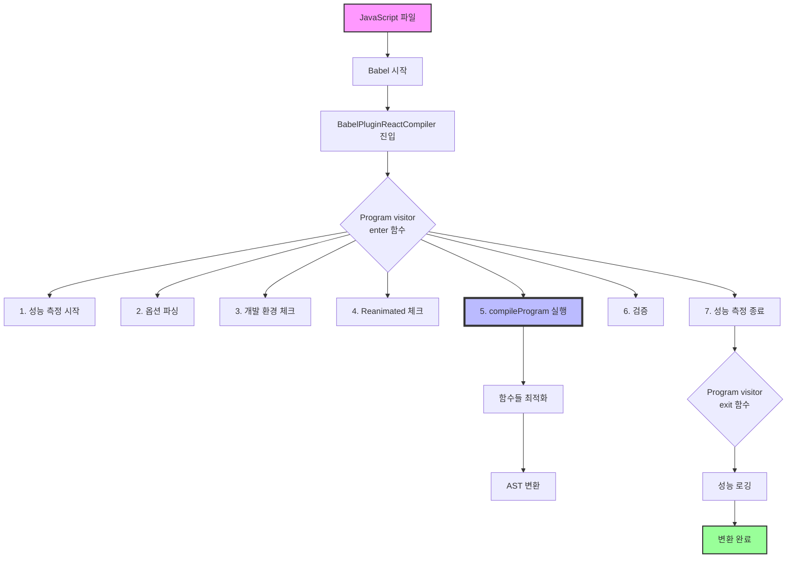

# React Compiler BabelPlugin.ts

## 📌 개요

`BabelPlugin.ts`는 React Compiler가 Babel 빌드 과정에 통합되는 진입점입니다. 이 파일은 Babel이 React 코드를 변환할 때 React Compiler를 끼워넣는 다리 역할을 합니다.

## 🌟 Babel 플러그인 기본 개념

### Babel의 변환 과정

```
원본 코드 → Babel + 플러그인들 → 변환된 코드
```

### 핵심 용어 설명

- **Babel**: JavaScript 코드 변환기 (번역가)
- **플러그인**: Babel의 변환 과정을 커스터마이징하는 도구 (번역 도우미)
- **visitor**: AST 노드를 방문할 때 실행할 함수들의 모음 (규칙집)
- **AST (Abstract Syntax Tree)**: 코드의 구조를 트리 형태로 표현한 것

## 📊 전체 동작 흐름



## 🔍 코드 상세 분석

### 1️⃣ 플러그인 기본 구조

```javascript
export default function BabelPluginReactCompiler(_babel: typeof BabelCore): BabelCore.PluginObj {
  return {
    name: 'react-forget', // 플러그인 이름 (내부 코드명)
    visitor: {
      // Babel이 AST를 순회할 때 실행할 함수들
      Program: {
        // 파일 전체를 나타내는 노드
        enter() {}, // 파일 처리 시작할 때
        exit() {}, // 파일 처리 끝날 때
      },
    },
  }
}
```

### 2️⃣ Program visitor의 enter 함수 (핵심!)

파일 처리가 시작될 때 실행되는 함수입니다:

#### 단계 1: 기본 정보 수집

```javascript
const filename = pass.filename ?? 'unknown'
```

- 현재 처리 중인 파일명을 가져옵니다
- 파일명이 없으면 'unknown'으로 대체

#### 단계 2: 성능 측정 시작 (선택사항)

```javascript
if (ENABLE_REACT_COMPILER_TIMINGS === true) {
  performance.mark(`${filename}:start`, {
    detail: 'BabelPlugin:Program:start',
  })
}
```

- 환경 변수로 성능 측정을 활성화할 수 있습니다
- 각 파일의 컴파일 시간을 측정합니다

#### 단계 3: 플러그인 옵션 파싱

```javascript
let opts = parsePluginOptions(pass.opts)
```

- babel.config.js에서 전달받은 옵션들을 파싱합니다
- compilationMode, gating, logger 등의 설정을 처리합니다

#### 단계 4: 개발 환경 체크 및 설정

```javascript
const isDev = (typeof __DEV__ !== 'undefined' && __DEV__ === true) || process.env['NODE_ENV'] === 'development'

if (opts.environment.enableResetCacheOnSourceFileChanges !== false && isDev) {
  opts = {
    ...opts,
    environment: {
      ...opts.environment,
      enableResetCacheOnSourceFileChanges: true,
    },
  }
}
```

- 개발 환경에서는 파일 변경 시 캐시를 리셋합니다
- 핫 리로딩 시 올바른 동작을 보장합니다

#### 단계 5: React Native Reanimated 호환성 처리

```javascript
if (opts.enableReanimatedCheck === true && pipelineUsesReanimatedPlugin(pass.file.opts.plugins)) {
  opts = injectReanimatedFlag(opts)
}
```

- React Native의 Reanimated 라이브러리와의 충돌을 방지합니다
- 특별한 최적화 플래그를 주입합니다

#### 단계 6: 핵심 - 컴파일 실행!

```javascript
const result = compileProgram(prog, {
  opts, // 설정
  filename: pass.filename ?? null, // 파일명
  comments: pass.file.ast.comments ?? [], // 주석들
  code: pass.file.code, // 원본 코드
})
```

**compileProgram이 하는 일**:

1. 파일 안의 모든 함수를 찾습니다
2. 각 함수가 컴포넌트인지 Hook인지 판별합니다
3. opt-in/opt-out 지시어를 확인합니다
4. 최적화를 적용합니다
5. 새로운 코드를 생성합니다

#### 단계 7: 변환 검증

```javascript
validateNoUntransformedReferences(prog, pass.filename ?? null, opts.logger, opts.environment, result)
```

- 최적화 과정에서 놓친 참조가 없는지 확인합니다
- 모든 변수가 올바르게 변환되었는지 검증합니다

### 3️⃣ Program visitor의 exit 함수

파일 처리가 끝날 때 실행되는 함수입니다:

```javascript
exit(_, pass): void {
  if (ENABLE_REACT_COMPILER_TIMINGS === true) {
    const filename = pass.filename ?? 'unknown';

    // 성능 측정 종료
    const measurement = performance.measure(filename, {
      start: `${filename}:start`,
      end: `${filename}:end`,
      detail: 'BabelPlugin:Program',
    });

    // 로거가 있으면 기록
    if ('logger' in pass.opts && pass.opts.logger != null) {
      const logger: Logger = pass.opts.logger as Logger;
      logger.logEvent(filename, {
        kind: 'Timing',
        measurement,
      });
    }
  }
}
```

## 💡 실제 동작 예시

### 변환 전 (원본 코드)

```javascript
function MyComponent() {
  const [count, setCount] = useState(0)
  const doubled = count * 2 // 매번 재계산됨
  return <div>{doubled}</div>
}
```

### 변환 후 (최적화된 코드)

```javascript
function MyComponent() {
  const $ = _c(2) // 메모 캐시 생성
  const [count, setCount] = useState(0)

  let doubled
  if ($[0] !== count) {
    doubled = count * 2 // 필요할 때만 계산
    $[0] = count
    $[1] = doubled
  } else {
    doubled = $[1] // 캐시된 값 사용
  }

  return <div>{doubled}</div>
}
```

## 🛠️ 디버깅 및 개발 팁

### 1. 성능 측정 활성화

```bash
ENABLE_REACT_COMPILER_TIMINGS=1 npm run build
```

### 2. 로거 설정으로 상세 정보 보기

```javascript
// babel.config.js
module.exports = {
  plugins: [
    [
      'babel-plugin-react-compiler',
      {
        logger: {
          logEvent(filename, event) {
            console.log(`[React Compiler] ${filename}:`, event)
          },
        },
      },
    ],
  ],
}
```

### 3. 개발 환경에서 캐시 리셋 비활성화

```javascript
// babel.config.js
module.exports = {
  plugins: [
    [
      'babel-plugin-react-compiler',
      {
        environment: {
          enableResetCacheOnSourceFileChanges: false,
        },
      },
    ],
  ],
}
```

## 📌 핵심 포인트 정리

1. **이 파일은 단순한 연결고리입니다**

   - 실제 최적화 로직은 `compileProgram`에 있습니다
   - Babel과 React Compiler를 연결하는 인터페이스 역할입니다

2. **Program visitor 패턴을 사용합니다**

   - Babel의 표준 방식으로 AST를 순회합니다
   - enter에서 전처리, exit에서 후처리를 수행합니다

3. **환경별 최적화가 적용됩니다**

   - 개발/프로덕션 환경에 따라 다르게 동작합니다
   - 개발 환경에서는 디버깅을 위한 추가 기능이 활성화됩니다

4. **성능 모니터링이 내장되어 있습니다**

   - 각 파일의 컴파일 시간을 측정할 수 있습니다
   - 성능 병목 지점을 찾는 데 유용합니다

5. **확장성을 고려한 설계입니다**
   - 다양한 옵션과 훅을 통해 동작을 커스터마이징할 수 있습니다
   - 로거, gating 등의 기능을 플러그인 형태로 추가할 수 있습니다

## 🚀 다음 단계

이제 BabelPlugin.ts를 이해했다면, 다음을 학습해보세요:

1. `compileProgram` 함수의 내부 동작 (Program.ts)
2. `Pipeline.ts`에서 실제 컴파일 파이프라인 구현
3. `BuildHIR.ts`에서 AST를 HIR로 변환하는 과정

---

_이 문서는 React Compiler의 BabelPlugin.ts 파일을 기반으로 작성되었습니다._
