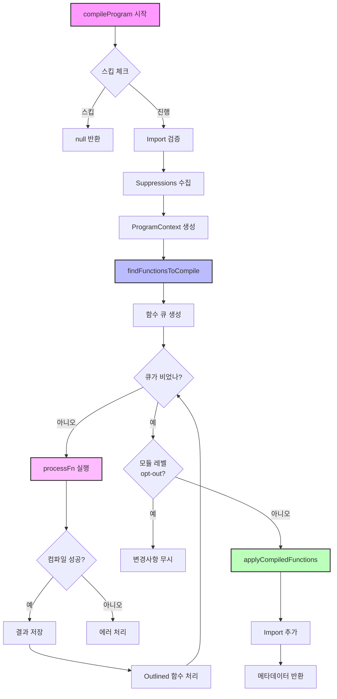

# Program.ts

## 📌 개요

`Program.ts`는 React Compiler의 핵심 엔트리포인트로, 전체 파일의 컴파일 프로세스를 관리합니다. BabelPlugin.ts가 진입점이라면, Program.ts는 실제 컴파일 작업의 오케스트레이터입니다.

## 🎯 주요 역할

1. **함수 탐색**: 파일 내 모든 React 컴포넌트와 Hook 찾기
2. **컴파일 대상 선별**: compilationMode와 지시어에 따라 컴파일할 함수 결정
3. **컴파일 실행**: 각 함수를 최적화된 버전으로 변환
4. **코드 적용**: 변환된 코드를 AST에 반영

## 📊 전체 컴파일 흐름



## 🔍 주요 타입과 인터페이스

### 1. CompilerPass

```typescript
export type CompilerPass = {
  opts: PluginOptions // 컴파일러 옵션
  filename: string | null // 현재 파일명
  comments: Array<t.CommentBlock | t.CommentLine> // 주석들
  code: string | null // 원본 코드
}
```

### 2. BabelFn

```typescript
export type BabelFn =
  | NodePath<t.FunctionDeclaration> // function foo() {}
  | NodePath<t.FunctionExpression> // const foo = function() {}
  | NodePath<t.ArrowFunctionExpression> // const foo = () => {}
```

### 3. CompileResult

```typescript
export type CompileResult = {
  kind: 'original' | 'outlined' // 원본 함수 vs 추출된 함수
  originalFn: BabelFn // 원본 함수 노드
  compiledFn: CodegenFunction // 컴파일된 결과
}
```

### 4. ReactFunctionType

```typescript
type ReactFunctionType =
  | 'Component' // React 컴포넌트
  | 'Hook' // React Hook
  | 'Other' // 일반 함수 (all 모드에서만)
  | null // 컴파일 대상 아님
```

## 🚀 핵심 함수들

### 1️⃣ compileProgram - 메인 엔트리포인트

```javascript
export function compileProgram(
  program: NodePath<t.Program>,
  pass: CompilerPass,
): CompileProgramMetadata | null {
  // 1. 스킵 여부 확인
  if (shouldSkipCompilation(program, pass)) {
    return null;
  }

  // 2. 제한된 import 검증
  const restrictedImportsErr = validateRestrictedImports(program, pass.opts.environment);

  // 3. ESLint/Flow suppressions 수집
  const suppressions = findProgramSuppressions(pass.comments, ...);

  // 4. 프로그램 컨텍스트 생성
  const programContext = new ProgramContext({...});

  // 5. 컴파일할 함수들 찾기
  const queue = findFunctionsToCompile(program, pass, programContext);

  // 6. 각 함수 컴파일
  while (queue.length !== 0) {
    const compiled = processFn(...);
    // outlined 함수 처리, 결과 저장
  }

  // 7. 컴파일된 함수들 적용
  applyCompiledFunctions(program, compiledFns, pass, programContext);

  return {retryErrors, inferredEffectLocations};
}
```

### 2️⃣ findFunctionsToCompile - 함수 탐색

```javascript
function findFunctionsToCompile(
  program: NodePath<t.Program>,
  pass: CompilerPass,
  programContext: ProgramContext,
): Array<CompileSource> {
  const queue: Array<CompileSource> = []

  program.traverse({
    // 클래스 내부 함수는 스킵 (this 참조 위험)
    ClassDeclaration(node) {
      node.skip()
    },

    // 함수 선언/표현식 처리
    FunctionDeclaration: traverseFunction,
    FunctionExpression: traverseFunction,
    ArrowFunctionExpression: traverseFunction,
  })

  return queue
}
```

### 3️⃣ getReactFunctionType - 함수 타입 판별

```javascript
function getReactFunctionType(fn: BabelFn, pass: CompilerPass): ReactFunctionType | null {
  // 1. opt-in 지시어 확인
  if (hasOptInDirective(fn)) {
    return getComponentOrHookLike(fn) ?? 'Other'
  }

  // 2. 명시적 선언 확인
  if (isComponentDeclaration(fn) || isHookDeclaration(fn)) {
    return componentSyntaxType
  }

  // 3. compilationMode별 처리
  switch (pass.opts.compilationMode) {
    case 'annotation':
      return null // opt-in만

    case 'infer':
      return getComponentOrHookLike(fn) // 자동 감지

    case 'syntax':
      return componentSyntaxType // 명시적 선언만

    case 'all':
      return getComponentOrHookLike(fn) ?? 'Other' // 모든 최상위 함수
  }
}
```

### 4️⃣ processFn - 개별 함수 처리

```javascript
function processFn(
  fn: BabelFn,
  fnType: ReactFunctionType,
  programContext: ProgramContext,
): null | CodegenFunction {
  // 1. 지시어 확인
  const directives = {
    optIn: tryFindDirectiveEnablingMemoization(...),
    optOut: findDirectiveDisablingMemoization(...)
  };

  // 2. 컴파일 시도
  const compileResult = tryCompileFunction(fn, fnType, programContext);

  // 3. 에러 처리
  if (compileResult.kind === 'error') {
    if (directives.optOut != null) {
      logError(...); // opt-out이면 로그만
    } else {
      handleError(...); // 아니면 빌드 실패 가능
    }
  }

  // 4. opt-out 처리
  if (directives.optOut != null && !programContext.opts.ignoreUseNoForget) {
    logEvent('CompileSkip');
    return null;
  }

  // 5. 컴파일 모드별 최종 처리
  if (programContext.opts.compilationMode === 'annotation' && directives.optIn == null) {
    return null; // annotation 모드에서 opt-in 없으면 스킵
  }

  return compiledFn;
}
```

## 🎨 컴포넌트/Hook 판별 로직

### 컴포넌트 판별 조건

```javascript
function isComponent(fn) {
  return (
    // 1. 이름이 대문자로 시작
    /^[A-Z]/.test(name) &&
    // 2. JSX를 반환하거나 Hook을 호출
    callsHooksOrCreatesJsx(fn) &&
    // 3. 매개변수가 적절함 (0-2개, props와 ref)
    isValidComponentParams(fn.params) &&
    // 4. 컴포넌트가 아닌 것을 반환하지 않음
    !returnsNonNode(fn)
  )
}
```

### Hook 판별 조건

```javascript
function isHook(fn) {
  return (
    // 1. 이름이 'use'로 시작하고 대문자가 따라옴
    /^use[A-Z0-9]/.test(name) &&
    // 2. Hook을 호출하거나 JSX 생성
    callsHooksOrCreatesJsx(fn)
  )
}
```

## 🚦 Compilation Mode별 동작

### 1. annotation 모드

```javascript
// 오직 opt-in 지시어가 있는 함수만 컴파일
function Component() {
  'use memo' // ✅ 컴파일됨
  return <div />
}

function Other() {
  // ❌ 스킵
  return <div />
}
```

### 2. infer 모드 (기본값)

```javascript
// 컴포넌트/Hook처럼 보이는 함수 자동 감지
function MyComponent() {
  // ✅ 자동 감지
  return <div />
}

function useMyHook() {
  // ✅ 자동 감지
  return useState()
}

function helper() {
  // ❌ 일반 함수 스킵
  return 42
}
```

### 3. syntax 모드

```javascript
// 명시적 선언만
export component Foo() {  // ✅ 명시적 컴포넌트
  return <div />;
}

export hook useBar() {    // ✅ 명시적 Hook
  return useState();
}

function Baz() {          // ❌ 일반 선언 스킵
  return <div />;
}
```

### 4. all 모드

```javascript
// 최상위 레벨 모든 함수
function anything() {
  // ✅ 모든 최상위 함수
  return 'compiled!'
}

function outer() {
  function inner() {
    // ❌ 중첩 함수는 제외
    return 'not compiled'
  }
}
```

## 🛡️ 에러 처리 전략

### 1. 에러 레벨

```javascript
// ❌ 치명적 에러 - 빌드 실패
throw new CompilerError('Invalid configuration')

// ⚠️ 복구 가능한 에러
if (hasOptOut) {
  logError(error) // 로그만, 빌드 계속
} else {
  handleError(error) // 빌드 실패 가능
}
```

### 2. Retry 메커니즘

```javascript
// 첫 시도 실패 시
if (compileResult.kind === 'error') {
  // Fire나 Effect 추론만 있으면 재시도
  const retryResult = retryCompileFunction(fn, fnType, programContext)
  if (retryResult?.hasFireRewrite || retryResult?.hasInferredEffect) {
    return retryResult
  }
}
```

## 💡 Outlined Functions

React Compiler는 복잡한 로직을 별도 함수로 추출할 수 있습니다:

```javascript
// 원본
function Component() {
  const complexLogic = /* 매우 복잡한 로직 */;
  return <div>{complexLogic}</div>;
}

// 컴파일 후
function Component() {
  const complexLogic = _Component$complexLogic();
  return <div>{complexLogic}</div>;
}

function _Component$complexLogic() {
  /* 추출된 복잡한 로직 */
}
```

## 🔧 디버깅 팁

### 1. 로깅 활성화

```javascript
// babel.config.js
{
  plugins: [
    [
      'babel-plugin-react-compiler',
      {
        logger: {
          logEvent(filename, event) {
            console.log(`[${filename}] ${event.kind}:`, event)
          },
        },
      },
    ],
  ]
}
```

### 2. 특정 파일만 컴파일

```javascript
// sources 옵션 사용
{
  sources: (filename) => {
    return filename.includes('components/')
  }
}
```

### 3. 컴파일 스킵 이유 확인

```javascript
// CompileSkip 이벤트 확인
{
  kind: 'CompileSkip',
  reason: 'Skipped due to \'use no memo\' directive.',
  loc: { line: 10, column: 2 }
}
```

## 📝 체크리스트

Program.ts를 이해했는지 확인하기:

- [ ] compileProgram의 전체 흐름을 설명할 수 있다
- [ ] 4가지 compilationMode의 차이를 안다
- [ ] 컴포넌트와 Hook 판별 로직을 이해한다
- [ ] opt-in/opt-out 지시어 처리 과정을 안다
- [ ] 에러 처리 전략을 이해한다
- [ ] Outlined functions의 개념을 안다
- [ ] ProgramContext의 역할을 이해한다

## 🚀 다음 단계

1. **Pipeline.ts**: 실제 컴파일 파이프라인 구현
2. **BuildHIR.ts**: AST를 HIR로 변환하는 과정
3. **CodegenReactiveFunction.ts**: 최적화된 코드 생성

---
