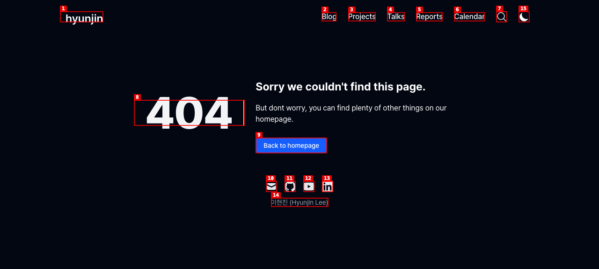
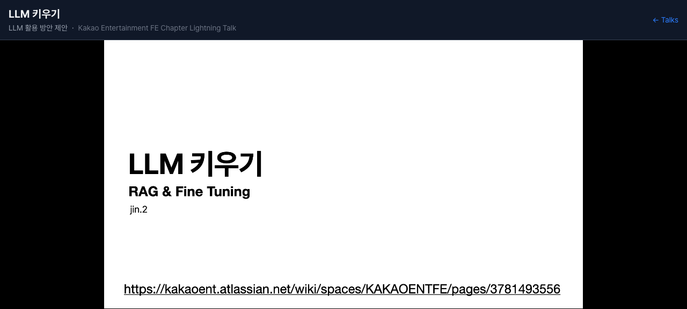
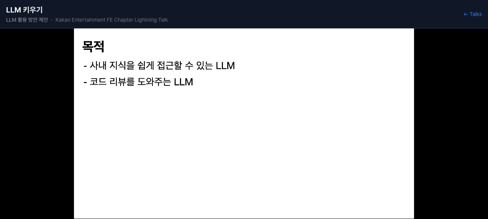
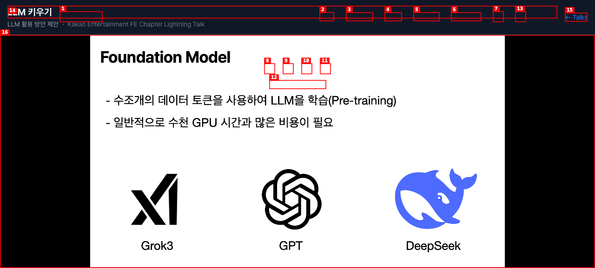
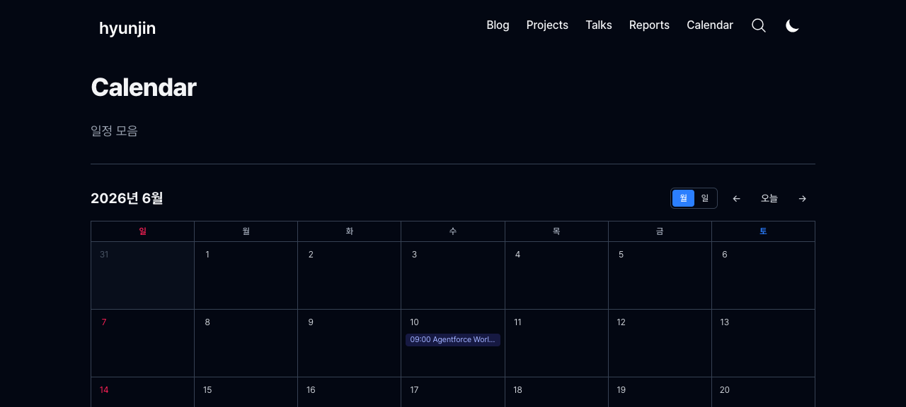
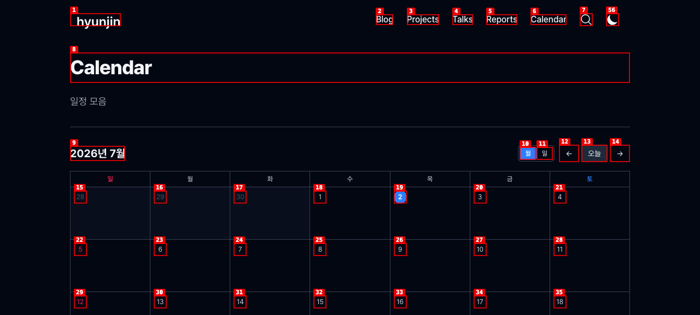
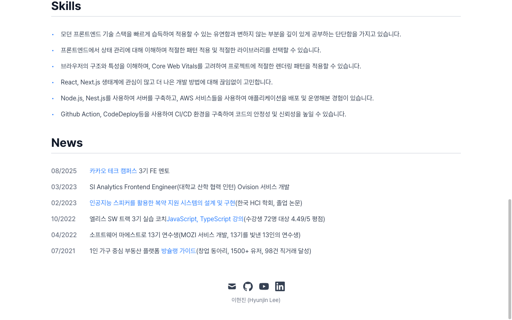
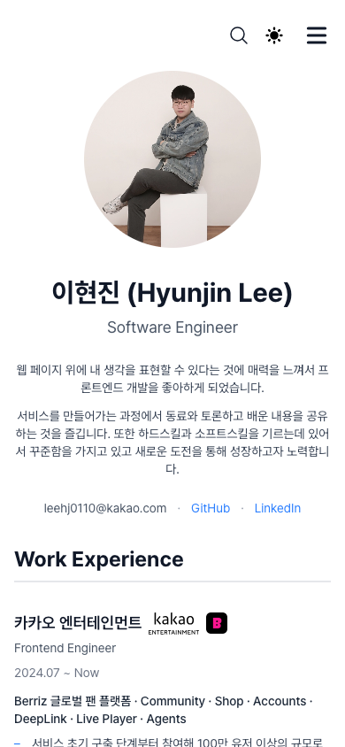

# Dogfood Report: hyunjinlee.com

| Field | Value |
|-------|-------|
| **Date** | 2026-07-02 |
| **App URL** | https://hyunjinlee.com |
| **Session** | hyunjinlee-com |
| **Scope** | 전체 사이트 (홈, 블로그, Projects, Talks, Reports, Calendar, 검색, 테마) |

## Summary

| Severity | Count |
|----------|-------|
| Critical | 0 |
| High | 1 |
| Medium | 1 |
| Low | 4 |
| **Total** | **6** |

## Issues

### ISSUE-001: 404 페이지 오타 "dont" (don't)

| Field | Value |
|-------|-------|
| **Severity** | low |
| **Category** | content |
| **URL** | https://hyunjinlee.com/blog/deeplink (임의 404 URL) |
| **Repro Video** | N/A |

**Description**

404 페이지 본문이 "But dont worry, you can find plenty of other things on our homepage."로 표시된다. "dont"는 "don't"의 오타.

**Repro Steps**

1. 존재하지 않는 URL(예: /blog/deeplink) 접속 → 404 페이지의 본문 확인
   

---

### ISSUE-002: Talks 슬라이드 뷰어가 키보드 방향키로만 조작 가능 (마우스·터치 사용자는 다음 슬라이드로 넘길 수 없음)

| Field | Value |
|-------|-------|
| **Severity** | high |
| **Category** | ux / accessibility |
| **URL** | https://hyunjinlee.com/talks/llm-growing (다른 talk 상세도 동일 구조) |
| **Repro Video** | videos/issue-002-repro.webm |

**Description**

Talk 상세 페이지는 iframe 슬라이드 뷰어로 렌더링되는데, 화면에 이전/다음 버튼·페이지 인디케이터·조작 힌트가 전혀 없다. 마우스 휠 스크롤, 슬라이드 클릭 모두 아무 동작을 하지 않고, 오직 키보드 방향키(←/→/↓)로만 슬라이드가 넘어간다. 터치 기기(모바일·태블릿)에서는 물리 키보드가 없어 첫 슬라이드 이후를 볼 방법이 사실상 없다. body가 overflow:hidden이고 iframe 내부 문서도 스크롤 불가(scrollHeight == clientHeight), 내부에 button/a 요소 0개임을 확인했다.

**Repro Steps**

1. https://hyunjinlee.com/talks/llm-growing 접속 (슬라이드 표시)
   

2. 마우스 휠로 스크롤 → 슬라이드 변화 없음
   

3. 슬라이드 중앙 클릭 → 슬라이드 변화 없음
   

4. **Observe:** 키보드 ArrowRight를 눌러야만 다음 슬라이드("Foundation Model")로 이동. 화면상 어떤 내비게이션 UI도 없음
   

---

### ISSUE-003: Calendar 기본 뷰가 현재 월이 아닌 지난달(6월)로 열림

| Field | Value |
|-------|-------|
| **Severity** | medium |
| **Category** | functional |
| **URL** | https://hyunjinlee.com/calendar |
| **Repro Video** | videos/issue-003-repro.webm |

**Description**

오늘이 2026-07-02인데 Calendar 페이지 최초 진입 시 "2026년 6월"이 표시된다. "오늘" 버튼을 누르면 "2026년 7월"로 이동하므로, 초기 상태가 현재 날짜 기준이 아니라 (마지막 이벤트가 있는 달 또는 빌드 시점 등) 고정된 과거 달로 초기화되는 것으로 보인다. 사용자는 진입할 때마다 수동으로 이동해야 한다.

**Repro Steps**

1. https://hyunjinlee.com/calendar 접속 → 헤더가 "2026년 6월" (오늘은 7월 2일)
   

2. **Observe:** "오늘" 버튼 클릭 시 "2026년 7월"로 바뀜 → 초기 월이 잘못되었음이 확인됨
   

---

### ISSUE-004: 홈 News 섹션 텍스트 띄어쓰기 누락 ("실습 코치JavaScript, TypeScript 강의")

| Field | Value |
|-------|-------|
| **Severity** | low |
| **Category** | content |
| **URL** | https://hyunjinlee.com/ (News 섹션, 10/2022 항목) |
| **Repro Video** | N/A |

**Description**

News 섹션의 10/2022 항목이 "엘리스 SW 트랙 3기 실습 코치JavaScript, TypeScript 강의(수강생 72명...)"로 렌더링된다. "코치"와 링크 "JavaScript, TypeScript 강의" 사이 공백이 없어 두 단어가 붙어 보인다. 같은 섹션의 "Frontend Engineer(대학교", "구현(한국" 등 괄호 앞 공백 누락도 함께 정리하면 좋다.

**Repro Steps**

1. 홈 하단 News 섹션으로 스크롤 → 10/2022 항목 확인
   

---

### ISSUE-005: 모바일 헤더에 로고/홈 링크가 보이지 않음

| Field | Value |
|-------|-------|
| **Severity** | low |
| **Category** | visual / ux |
| **URL** | https://hyunjinlee.com/ (뷰포트 390x844) |
| **Repro Video** | N/A |

**Description**

모바일 뷰포트에서 헤더 좌측이 비어 있다. 로고 텍스트 "hyunjin"이 `hidden sm:block`으로 모바일에서 숨겨지고, 로고 이미지 자리(`div.mr-3`)는 비어 있어서 홈 링크가 12x0px 크기로 존재만 하고 보이지 않는다. 홈으로 가려면 햄버거 메뉴의 "Home"을 거쳐야만 한다.

**Repro Steps**

1. 390px 폭 뷰포트에서 홈 접속 → 헤더 좌측에 로고 없음 (우측에 검색/테마/메뉴 버튼만 존재)
   

---

### ISSUE-006: 블로그 슬러그가 한글 공백·대소문자 그대로 URL에 노출 (소문자 URL은 404)

| Field | Value |
|-------|-------|
| **Severity** | low |
| **Category** | functional / ux |
| **URL** | https://hyunjinlee.com/blog/DeepLink vs /blog/deeplink |
| **Repro Video** | N/A |

**Description**

글 URL이 파일명 그대로 생성되어 `/blog/낙관적%20업데이트%20순서제어`처럼 인코딩된 공백이 포함되고, `/blog/DeepLink`는 대소문자를 정확히 맞춰야 열린다. `/blog/deeplink`(소문자)는 404. 공유·타이핑 시 쉽게 깨지는 URL 스킴이다. kebab-case 영문 슬러그(또는 대소문자 무시 리다이렉트)를 권장.

**Repro Steps**

1. https://hyunjinlee.com/blog/deeplink 접속 → 404 (정상 URL은 /blog/DeepLink)
   

---
