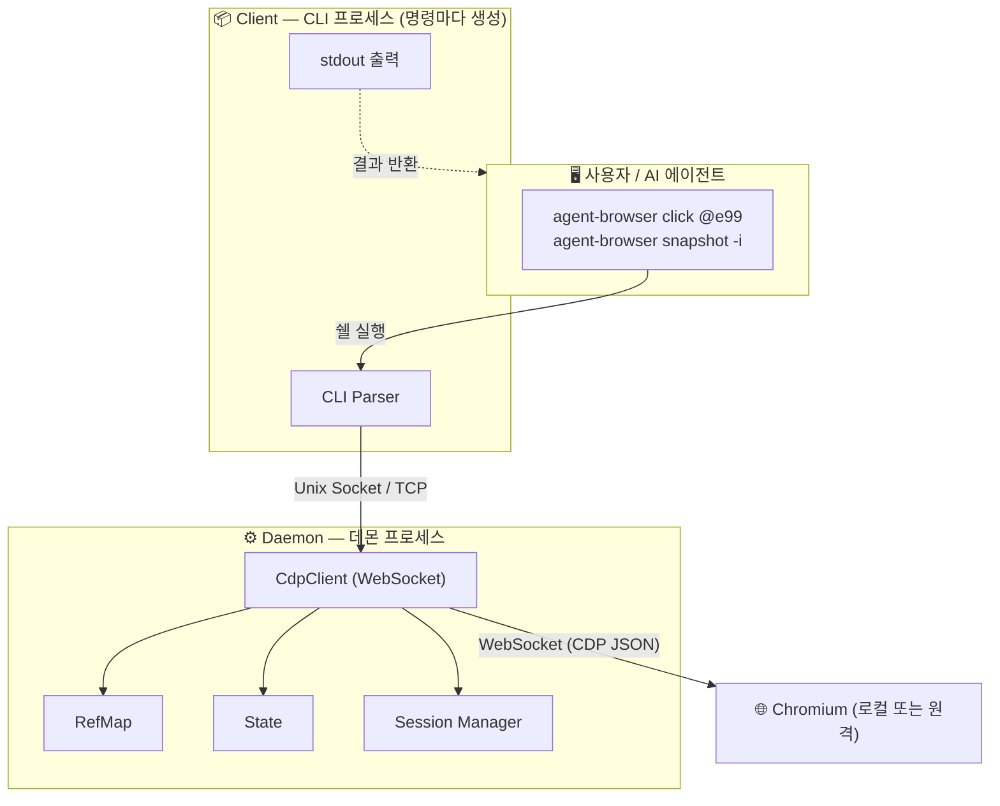

## AI 에이전트가 브라우저를 사용할 때 생기는 문제

AI 에이전트에게 브라우저를 쥐어주면, 사람과는 다른 문제가 생긴다.

**토큰으로 변환된 DOM은 비싸고 비효율적이다.**
AI 에이전트에게 필요한 건 페이지의 모든 `<div>`와 CSS 클래스가 아니라, "로그인 버튼이 어디 있고 검색창에 뭘 입력할 수 있는지"다.
하지만 웹 페이지의 DOM은 수천에서 수만 토큰을 차지한다.
페이지 하나를 "보는" 데만 이 비용을 쓰는 건, 수십 번의 페이지 탐색이 필요한 실제 작업에서 치명적이다.

**요소를 안정적으로 가리키기 어렵다.**
AI가 생성한 `#app > div:nth-child(3) > ul > li:first-child > a` 같은 CSS 셀렉터는 DOM 구조가 조금만 바뀌어도 무너진다.
사람은 시각적으로 "검색 버튼"을 인식하지만, AI는 매번 정확한 셀렉터 문자열을 생성해야 한다.

**도구가 많으면 모델의 의사결정이 어려워진다.**
MCP 기반 브라우저 도구는 수십 개의 도구를 노출한다. 모델은 매 턴마다 이 중 어떤 도구를 어떤 파라미터로 호출할지 결정해야 한다.
선택지가 많아질수록 잘못된 도구를 고르거나 도구를 호출하지 않을 수 있다.

**[agent-browser](https://github.com/vercel-labs/agent-browser)**는 경량화된 접근성 트리 스냅샷, 시맨틱 fallback을 갖춘 Ref 시스템, MCP 없이도 동작하는 Rust 네이티브 바이너리로 이 문제들을 해결한다.

---

## 접근성 트리: AI가 웹을 읽는 방법

agent-browser는 DOM 대신 **접근성 트리(Accessibility Tree, AX Tree)**를 AI에게 보여주되, **AI가 상호작용할 수 있는 요소만 남을 때까지 필터링**한다.

브라우저는 HTML DOM을 렌더링할 때, 시각적 렌더 트리와 별도로 접근성 트리를 내부적으로 구축한다.
이 트리는 원래 스크린 리더 같은 보조 기술이 페이지를 이해할 수 있도록 만들어진 것으로, 각 노드에 **role**(버튼, 링크, 텍스트필드 등), **name**(표시 텍스트), **상태**(disabled, checked 등) 같은 의미론적 정보가 들어있다.

### DOM vs 접근성 트리

|  | DOM | 접근성 트리 |
|--|-----|-----------|
| 표현 | `<div class="btn-primary sc-1a2b3c">` | `button "로그인"` |
| 노드 수 | 수천 개 (시각적/레이아웃용 포함) | 의미 있는 노드만 |
| 노이즈 | CSS 클래스, 스타일, data 속성 등 | role + name으로 정리됨 |

AI 에이전트 입장에서 DOM보다 접근성 트리가 훨씬 간결하고 의미론적이다.
토큰을 적게 쓰면서도 페이지 구조를 정확히 파악할 수 있다.
사람이 스크린 리더로 웹을 "읽는" 것처럼, AI가 접근성 트리로 페이지를 이해하는 셈이다.

### CDP로 접근성 트리 가져오기

agent-browser는 CDP(Chrome DevTools Protocol)를 통해 접근성 트리를 가져온다.
CDP는 Chrome이 외부 프로그램과 통신하기 위해 제공하는 WebSocket 기반 프로토콜이며, `Accessibility.getFullAXTree` 명령으로 현재 페이지의 전체 접근성 트리를 JSON 형태로 한 번에 반환받을 수 있다.

```rust
// cli/src/native/snapshot.rs
let ax_tree: GetFullAXTreeResult = client
    .send_command_typed(
        "Accessibility.getFullAXTree",  // CDP 명령
        &ax_params,
        Some(effective_session_id),
    )
    .await?;

let (tree_nodes, root_indices) = build_tree(&ax_tree.nodes);
```

1. Rust CDP 클라이언트가 WebSocket으로 Chrome에 `Accessibility.getFullAXTree` 명령을 보냄
2. Chrome이 현재 페이지의 모든 AX 노드 목록을 JSON으로 응답
3. `build_tree()`가 이 플랫 리스트를 부모-자식 관계를 가진 트리 구조로 변환
4. 이 트리를 텍스트 snapshot으로 직렬화해서 AI 에이전트에게 전달

### naver.com: HTML vs 스냅샷

naver.com의 검색 영역을 HTML로 넘기면 이런 모습이다:

```html
<div class="search_area" role="search">
  <div class="search_input_wrap">
    <div class="search_box">
      <input id="query" class="search_input" type="text"
        placeholder="검색어를 입력해 주세요." autocomplete="off"
        data-atcmp-init="false" aria-expanded="false" />
      <button class="btn_search" type="submit">
        <span class="blind">검색</span>
        <svg class="ico_search_submit" viewBox="0 0 24 24">...</svg>
      </button>
    </div>
  </div>
</div>
<div class="service_area">
  <ul class="list_service">
    <li class="item"><a href="https://mail.naver.com" class="link">메일</a></li>
    <li class="item"><a href="https://cafe.naver.com" class="link">카페</a></li>
    <li class="item"><a href="https://blog.naver.com" class="link">블로그</a></li>
    <li class="item"><a href="https://news.naver.com" class="link">뉴스</a></li>
    ...
  </ul>
</div>
```

agent-browser의 `snapshot -i` 커맨드는 같은 영역을 이렇게 표현한다:

```
$ agent-browser snapshot -i

- heading "NAVER" [level=1]
  - link "NAVER" [ref=e91]
- combobox "검색어를 입력해 주세요." [ref=e154]
- button "검색" [ref=e121]
- navigation "주요 서비스"
  - link "메일" [ref=e95]
  - link "카페" [ref=e96]
  - link "블로그" [ref=e97]
  - link "뉴스" [ref=e99]
  - link "증권" [ref=e100]
```

`<div class="search_area">`, `<ul class="list_service">` 같은 래퍼 요소는 전부 사라지고, AI가 실제로 상호작용할 수 있는 요소만 남는다.

naver.com 전체 페이지로 측정하면 이 차이가 더 극명해진다 (Playwright MCP vs agent-browser v0.25.3):

| 지표 | Playwright MCP | agent-browser (`snapshot -i`) | 감소율 |
|------|:-:|:-:|:-:|
| 스냅샷 | 37,787 토큰 | 6,621 토큰 | **82%** |
| 클릭 응답 | 37,787 토큰 (스냅샷 재반환) | 2 토큰 (`✓ Done`) | **99.99%** |
| 할당된 ref 수 | 534개 | 329개 | **38%** |

같은 페이지를 보더라도 스냅샷 경량화의 차이가 크다.
에이전트가 페이지 상태를 확인할 때마다 이 토큰 차이가 누적되므로, 수십 번 페이지를 탐색하는 워크플로우에서는 전체 비용에 큰 영향을 미친다.

```
naver.com 토큰 소비 측정

Playwright MCP:        37,787 토큰  ████████████████████████████
agent-browser :         6,621 토큰  █████

-> 82% reduction
```

스냅샷은 AI 에이전트 기반 브라우저 자동화를 **경제적으로 가능하게** 만드는 핵심 설계 결정이다.

### 필터링: 노이즈를 줄이는 세 카테고리

그런데 접근성 트리를 그대로 반환하면 여전히 노이즈가 많다. agent-browser는 AX 노드를 세 가지 카테고리로 분류해서 한 번 더 필터링한다:

| 카테고리 | 역할(Role) 예시 | 처리 |
|----------|----------------|------|
| **Interactive** | button, link, textbox, checkbox, radio, combobox, slider, switch, tab, menuitem 등 28개 | 항상 ref 할당 |
| **Content** | heading, cell, gridcell, listitem, article, region, navigation, main 등 10개 | 이름이 있을 때만 ref 할당 |
| **Structural** | generic, group, list, table, row, document, application 등 20개 | ref 없이 구조만 표시 |

`-i` (interactive) 플래그를 주면 ref가 없는 노드를 건너뛰되, 그 자식은 재귀적으로 탐색한다. 결과적으로 상호작용 가능한 요소와 그 컨텍스트만 남고, 순수 구조적 노드는 출력에서 사라진다. AI 에이전트에게는 이 모드가 기본이다.

현대 웹 앱에는 `<div onclick="...">` 같은 비표준 클릭 가능 요소도 많다.
접근성 트리에서 이런 요소는 role이 `generic`이라 기본적으로 인터랙티브로 인식되지 않는다.
agent-browser는 `cursor: pointer` CSS 속성이나 `onclick`, `tabindex` 속성을 가진 요소를 자동으로 감지해서 인터랙티브로 승격시킨다.
내부적으로 `Runtime.evaluate`를 통해 DOM에서 이런 요소를 탐색하고, AX 트리의 `backend_node_id`와 매칭해서 ref를 부여한다.

### cross-origin iframe

단일 페이지 앱이 아닌 실제 웹에서는 결제 위젯, 광고, 임베디드 콘텐츠 등 **cross-origin iframe**이 빈번하다.
cross-origin iframe은 보안 정책상 부모 페이지에서 직접 접근할 수 없기 때문에, 일반적인 접근성 트리 조회로는 내부 요소가 보이지 않는다.

agent-browser는 CDP의 `Target.setAutoAttach`로 iframe이 생성될 때마다 별도의 CDP 세션을 자동으로 연결한다.
각 iframe 세션에서 독립적으로 `Accessibility.getFullAXTree`를 호출하고, 결과를 부모 스냅샷에 인라인으로 합친다.
에이전트 입장에서는 iframe 경계를 의식할 필요 없이 하나의 통합된 스냅샷을 받는다:

```
- heading "NAVER" [level=1]
  - link "NAVER" [ref=e91]
- combobox "검색어를 입력해 주세요." [ref=e154]
- button "검색" [ref=e121]
- Iframe "AD"                                    ← cross-origin
    - link "N+스토어 레저페스타 ..." [ref=e300]  ← iframe 내부 요소도 ref 할당
- region "뉴스스탠드"
  - tab "뉴스스탠드" [ref=e66]
```

{/*
### 텍스트 너머: Annotated Screenshots

텍스트 스냅샷은 대부분의 경우 충분하지만, 한계가 있다. 아이콘만 있는 버튼, canvas 콘텐츠, 시각적 레이아웃 검증 같은 상황에서는 텍스트만으로 페이지를 이해하기 어렵다.

`screenshot --annotate` 커맨드는 이 간극을 메운다. 스크린샷 위에 각 인터랙티브 요소의 위치를 빨간 테두리와 번호 라벨로 표시하고, 그 번호가 ref에 대응한다:

```bash
agent-browser screenshot --annotate ./page.png
# Output:
#    [1] @e1 button "Submit"
#    [2] @e2 link "Home"
#    [3] @e3 textbox "Email"
```

내부적으로 각 ref의 `backend_node_id`를 배치로 해석해 `getBoundingClientRect()`으로 좌표를 구한 뒤, `Runtime.evaluate`로 DOM에 임시 오버레이를 주입하고 스크린샷을 찍는다. 오버레이는 촬영 직후 제거된다.

핵심은 **annotated screenshot이 ref를 캐싱한다**는 점이다. 스크린샷을 찍은 직후 `@e1`으로 바로 클릭할 수 있다. 비전 모델이 이미지에서 "[1]" 라벨을 인식하고, 같은 ref로 상호작용하는 — 텍스트 스냅샷과 비전이 하나의 ref 체계로 통합되는 구조다.
*/}

---

## Ref 시스템: CSS 셀렉터 없이 요소 지정

스냅샷으로 페이지를 "읽었다"면, 다음은 요소와 "상호작용"해야 한다.
기존 도구는 이때 CSS 셀렉터를 사용한다.
하지만 AI 에이전트가 `button.submit-btn.primary` 같은 셀렉터를 생성하면, 다음 페이지 로드에서 클래스 이름이 바뀌거나 DOM 계층이 달라지는 순간 실패한다.

agent-browser는 CSS 셀렉터 대신 **Ref 시스템**으로 요소를 참조한다.
스냅샷에서 `[ref=e91]`, `[ref=e154]` 같은 레이블이 바로 ref다.
접근성 트리를 순회하면서 인터랙티브 요소를 만날 때마다 순서대로 할당된다.

AI 에이전트는 `@e121`이라고만 지정하면 된다.
내부 DOM 구조에 의존하지 않으므로, "검색" 버튼의 클래스 이름이 `btn_search`에서 바뀌든, 부모 `<div>` 구조가 변경되든 상관없다.

### 클릭 한 번의 여정

ref는 단순한 인덱스가 아니다. 내부적으로 `RefMap`이라는 구조체가 각 ref에 대해 다음 정보를 저장한다:

```rust
struct RefEntry {
    backend_node_id: Option<i64>,  // CDP 노드 식별자 (캐시)
    role: String,                   // "button", "textbox" 등
    name: String,                   // "검색", "뉴스" 등
    nth: Option<usize>,             // 동일 role+name 중 몇 번째인지
    selector: Option<String>,       // 특수 케이스용 CSS 셀렉터 (getByRole 등)
    frame_id: Option<String>,       // cross-origin iframe 식별
}
```

naver.com에서 `agent-browser click @e99`를 실행하면, CLI 프로세스가 데몬에 명령을 전달하고 내부에서 이런 일이 일어난다:

```
1. CLI가 커맨드를 파싱
   → "click" 액션, 타겟 "@e99"으로 분해

2. 데몬의 RefMap에서 @e99 조회
   → { backend_node_id: 187, role: "link", name: "뉴스" }

3. backend_node_id로 요소의 위치 계산 (fast path)
   → CDP: DOM.getBoxModel { backendNodeId: 187 }
   → content quad에서 중심 좌표 계산: (x: 362.0, y: 68.5)

4. (stale인 경우) AX 트리 재조회로 fallback
   → CDP: Accessibility.getFullAXTree
   → role="link", name="뉴스"인 노드 탐색 → 새 backendNodeId 획득

5. 마우스 이벤트 디스패치
   → CDP: Input.dispatchMouseEvent { type: "mouseMoved", x, y }
   → CDP: Input.dispatchMouseEvent { type: "mousePressed", x, y, button: "left" }
   → CDP: Input.dispatchMouseEvent { type: "mouseReleased", x, y, button: "left" }
```

4번 단계가 Ref 시스템의 핵심적인 안전장치다. `backend_node_id`는 페이지 부분 업데이트 등으로 stale해질 수 있다.
이때 저장된 `role`과 `name`으로 접근성 트리를 다시 조회해서 새로운 `backend_node_id`를 찾는다. 
같은 role+name을 가진 요소가 여러 개면 `nth`로 구분한다. 
CSS 셀렉터처럼 DOM 구조에 의존하지 않고, **시맨틱 속성**으로 요소를 재식별하는 것이다.

`fill` 명령은 다른 경로를 탄다. 텍스트 입력은 좌표가 아니라 **DOM 객체에 직접 접근**해야 하므로, `DOM.resolveNode`로 JavaScript 객체를 획득하고, `Runtime.callFunctionOn`으로 포커스와 값 초기화를 수행한 뒤, `Input.insertText`로 텍스트를 삽입한다.

### snapshot → 상호작용 루프

이 **snapshot → 분석 → 상호작용 → snapshot** 루프가 agent-browser의 기본 패턴이다:

```bash
# 1. 페이지 열기
agent-browser open https://www.naver.com

# 2. 스냅샷으로 페이지 파악
agent-browser snapshot -i
# → AI가 combobox "검색어를 입력해 주세요." [ref=e154]를 발견

# 3. ref로 상호작용
agent-browser fill @e154 "agent-browser"
agent-browser click @e121  # "검색" 버튼

# 4. 페이지가 변경되었으니 다시 스냅샷
agent-browser snapshot -i

# 5. 결과 텍스트 추출
agent-browser get text @e10
```

중요한 제약: **DOM이 변경되면 ref가 무효화된다.** 버튼을 클릭해서 페이지가 바뀌었다면, 반드시 다시 `snapshot`을 찍어서 새 ref를 확인해야 한다.

### Diff: 행동의 결과를 검증하다

에이전트가 폼을 채우고 버튼을 클릭했다. 의도한 대로 동작했을까? 다시 스냅샷을 찍어서 눈으로 비교하는 대신, `diff snapshot` 커맨드로 **접근성 트리 수준의 변경 사항**을 구조적으로 확인할 수 있다:

```bash
agent-browser snapshot -i                    # 기준 스냅샷
agent-browser fill @e3 "test@example.com"
agent-browser diff snapshot                  # 기준과 현재 비교
```

```diff
  heading "Sign Up" [ref=e1]
  text "Create your account" [ref=e2]
- textbox "Email" [ref=e3]
+ textbox "Email" [ref=e3]: "test@example.com"
- button "Submit" [ref=e4]
+ button "Submit" [ref=e4] [disabled]
+ status "Sending..." [ref=e7]
  link "Already have an account?" [ref=e5]

3 additions, 2 removals, 3 unchanged
```

텍스트 필드에 값이 들어갔고, 버튼이 비활성화되었으며, 상태 메시지가 나타났다 — 에이전트는 이 diff를 보고 자신의 행동이 성공했는지 판단할 수 있다.

시각적 변화도 비교할 수 있다. `diff screenshot`은 두 스크린샷을 픽셀 단위로 비교해서 차이가 나는 영역을 빨간색으로 표시한 이미지를 생성한다. 컬러 거리 임계값(`--threshold`)을 조절해서 민감도를 제어할 수 있다. `diff url`은 두 URL의 페이지를 직접 비교해서, 스테이징과 프로덕션 환경 간의 차이를 한눈에 파악하게 해준다.

이 검증 단계가 추가되면 에이전트의 루프는 **snapshot → 상호작용 → diff → 판단**으로 확장되어, 단순한 실행자에서 자기 행동을 검증하는 자율적 에이전트로 진화한다.

---

## Architecture

스냅샷과 Ref가 "무엇을" 하는지 살펴봤다면, 이제 이것들이 실행되는 시스템의 구조를 살펴보자.

### Client → Daemon → Browser

agent-browser는 3-tier 구조다. Rust 네이티브 바이너리가 CDP로 Chromium과 직접 통신하되, 그 사이에 **데몬**이 위치한다.



쉘에서 `agent-browser click @e99`를 실행하면 가벼운 CLI 프로세스가 생성된다.
이 프로세스는 Unix Socket(macOS/Linux) 또는 TCP(Windows)로 데몬에 명령을 전달하고, 결과를 받아서 출력만 한다.
실제 브라우저 연결, RefMap, 세션 상태는 모두 데몬이 유지한다.
데몬이 이미 실행 중이면 재사용하고, 없으면 첫 명령 실행 시 자동으로 띄운다.

중간에 Playwright 같은 고수준 추상화 레이어가 없다. Rust 바이너리가 커맨드 파싱, ref 관리, 접근성 트리 파싱, 브라우저 조작을 **모두 직접** 수행한다.

### CDP: 브라우저와의 단일 프로토콜

데몬 안의 `CdpClient`는 Chromium과 WebSocket 연결을 유지한다.
각 명령에 고유 ID를 부여하고 `oneshot` 채널로 응답을 비동기 매칭하며, 이벤트(콘솔 로그, 네트워크 요청, 타겟 변경 등)는 `broadcast` 채널로 구독자들에게 전파한다.

앞서 스냅샷, 클릭, 텍스트 입력에서 등장한 CDP 명령들을 정리하면 이렇다:

| CDP 도메인 | 용도 | 주요 명령 |
|-----------|------|----------|
| **Accessibility** | 접근성 트리 조회 | `getFullAXTree` |
| **DOM** | 노드 조회, 위치 계산 | `getBoxModel`, `resolveNode`, `describeNode` |
| **Input** | 마우스/키보드 입력 | `dispatchMouseEvent`, `insertText`, `dispatchKeyEvent` |
| **Runtime** | JS 실행, 요소 조작 | `evaluate`, `callFunctionOn` |
| **Target** | 탭/iframe 관리 | `setAutoAttach`, `attachToTarget` |
| **Network** | 쿠키, 요청 제어 | `getAllCookies`, `setCookies` |
| **Page** | 네비게이션, 스크린샷 | `navigate`, `captureScreenshot` |

### 로컬과 원격

agent-browser는 두 가지 모드로 Chromium에 연결한다:

**로컬 모드** (기본): 시스템에 설치된 Chrome을 자동으로 탐색하여 실행하고, CDP 엔드포인트에 연결한다.

**원격 모드** (`--cdp`): 이미 실행 중인 Chromium 인스턴스에 연결한다. `--cdp host:port`를 지정하면 `/json/version` 엔드포인트에서 WebSocket URL을 자동으로 발견한다. 클라우드 브라우저 프로바이더나 Docker 환경에서 유용하다.

```bash
# 로컬 브라우저
agent-browser open https://www.naver.com

# 원격 브라우저 (Docker, 클라우드 등)
agent-browser --cdp 192.168.1.100:9222 open https://www.naver.com
```

---

## 보안과 세션

AI 에이전트에게 브라우저를 맡기는 건 강력하지만 위험하다.
에이전트가 의도치 않은 페이지로 이동하거나, 민감한 정보를 노출하거나, 파괴적인 액션을 실행할 수 있다.
agent-browser는 이 위험을 구조적으로 제어한다.

### 다층 보안 레이어

다섯 가지 보안 레이어가 독립적으로 동작한다:

- **도메인 허용목록**: 지정된 도메인만 방문 가능. JS 패칭과 Fetch 인터셉션 두 레이어로 서브리소스, WebSocket까지 차단
- **액션 정책**: JSON 파일로 특정 액션을 deny/confirm/allow 제어
- **인증 볼트**: 자격 증명을 AES-256-GCM으로 암호화 저장하여 LLM이 비밀번호를 절대 볼 수 없음
- **콘텐츠 경계**: 도구 출력과 웹 콘텐츠를 CSPRNG nonce로 구분하여 프롬프트 인젝션 방어
- **출력 제한**: 컨텍스트 플러딩 방지를 위한 최대 출력 문자 수 제한

예를 들어, 다음과 같이 액션 정책을 설정할 수 있다:

```json
{
  "default": "allow",
  "deny": ["eval"],
  "confirm": ["navigate"]
}
```

`eval` 명령은 아예 거부하고, 네비게이션에는 사전 확인을 요구한다.
모든 보안 기능은 opt-in 방식이라, 기존 워크플로우를 깨뜨리지 않으면서 필요한 수준만 점진적으로 적용할 수 있다.

### 세션 상태 관리

에이전트가 로그인 후 여러 페이지를 탐색하는 워크플로우에서는 세션 상태 관리가 필수다. agent-browser는 세 가지 수준을 제공한다:

1. **Ephemeral** (기본): 데몬이 살아있는 동안 상태 유지
2. **Profile**: 디렉토리에 모든 브라우저 상태를 영구 저장. 실제 Chrome 프로필처럼 동작
3. **Session State**: 쿠키와 localStorage를 파일로 저장하고 AES-256-GCM으로 암호화 가능

멀티 세션도 지원한다:

```bash
# 독립적인 브라우저 인스턴스
agent-browser --session agent1 open https://site-a.com
agent-browser --session agent2 open https://site-b.com
```

각 세션은 독립된 소켓과 PID 파일을 가지므로, 서로 간섭 없이 병렬로 작업할 수 있다.

### 크로스 도메인 상태

실제 웹 서비스는 여러 도메인에 걸쳐 동작한다.
OAuth 로그인 후 `accounts.google.com`의 쿠키와 `myapp.com`의 localStorage가 동시에 필요한 상황이 흔하다.
단순히 현재 페이지의 쿠키만 저장하면 다른 도메인의 상태가 누락된다.

agent-browser는 세션 동안 방문한 모든 오리진을 추적한다.
`save_state` 시 CDP의 `Network.getAllCookies`로 브라우저가 보유한 **모든 도메인의 쿠키**를 수집하고, 각 방문 오리진에 대해 CDP 타겟을 전환하며 `localStorage`를 개별 추출한다.
이렇게 수집된 상태는 하나의 암호화된 파일로 저장되어, 다음 세션에서 완전히 복원할 수 있다.

---

{/*
## 기존 도구와의 비교

지금까지 살펴본 설계가 기존 도구와 어떤 차이를 만드는지 정리해보자. 가장 자주 비교되는 Playwright MCP를 중심으로, Selenium과 Puppeteer도 함께 비교한다.

### 비교표

#### 페이지 표현과 요소 참조

| | agent-browser | Playwright MCP | Selenium 4 | Puppeteer |
|--|:---:|:---:|:---:|:---:|
| 접근성 트리 스냅샷 | O (필터링됨) | O (전체 반환) | X | O (`page.accessibility.snapshot()`) |
| Ref 시스템 | O (`@e1`) | O (`ref=e5`) | X | X |
| Ref 외 셀렉터 | CSS, XPath | CSS, role, ref | CSS, XPath, ID 등 8종 | CSS, XPath, ARIA, text |
| 스냅샷 필터링 (`-i` 등) | O (인터랙티브만) | selector/depth 제한만 | N/A | `interestingOnly` 옵션 |
| naver.com 스냅샷 토큰 | **6,621** | 41,337 | N/A | N/A |
| 클릭 후 응답 | `✓ Done` (2 토큰) | 전체 스냅샷 재반환 | 없음 | 없음 |
| Annotated Screenshots | O | X | X | X |
| Diff (스냅샷/스크린샷) | O | X | X | X |

#### 실행 환경과 아키텍처

| | agent-browser | Playwright MCP | Selenium 4 | Puppeteer |
|--|:---:|:---:|:---:|:---:|
| 런타임 의존성 | **없음 (Rust 네이티브)** | Node.js | Java/Python/C#/Ruby/JS | Node.js |
| 브라우저 통신 | CDP 직접 | Playwright API (CDP 위 추상화) | W3C WebDriver + CDP 접근 가능 | CDP + WebDriver BiDi |
| 실행 모델 | 쉘 커맨드 | MCP 서버 | 라이브러리 API | 라이브러리 API |
| MCP 없이 사용 | O (기본) | X (MCP 필수) | N/A | N/A |
| 노출 도구 수 | 1 (CLI) | 21~45+ (caps에 따라) | N/A | N/A |
| 멀티 브라우저 | Chromium | Chromium, Firefox, WebKit | **Chromium, Firefox, Edge, Safari** | Chromium, Firefox |

#### 보안

| | agent-browser | Playwright MCP | Selenium 4 | Puppeteer |
|--|:---:|:---:|:---:|:---:|
| 도메인 제한 | O (서브리소스/WS 포함) | 부분적 (`--allowed-hosts`) | X | X |
| 액션 정책 (deny/confirm) | O | X | X | X |
| 인증 볼트 (암호화 저장) | O (AES-256-GCM) | 부분적 (`--secrets`, 평문 dotenv) | X | X |
| 콘텐츠 경계 (프롬프트 인젝션 방어) | O (CSPRNG nonce) | X | X | X |
| 출력 길이 제한 | O | X | X | X |

#### 세션과 배포

| | agent-browser | Playwright MCP | Selenium 4 | Puppeteer |
|--|:---:|:---:|:---:|:---:|
| 세션 상태 저장/복원 | O | O (`--storage-state`) | 수동 (쿠키만) | 수동 (쿠키만) |
| 세션 암호화 | O (AES-256-GCM) | X | X | X |
| 멀티 세션 격리 | O (독립 소켓/PID) | X | X | X |
| 크로스 도메인 상태 일괄 수집 | O | X | X | X |
| 프로필 영속성 | O | O (기본 persistent) | O (`user-data-dir`) | O (`userDataDir`) |
| 클라우드 브라우저 | O (5개 프로바이더) | O (`--cdp-endpoint`) | **O (Grid + 다수 프로바이더)** | O (`connect()`) |
| iOS 지원 | O (시뮬레이터/실기기) | 에뮬레이션만 | Appium 별도 | 에뮬레이션만 |
*/}

---

## agent-browser가 의미하는 것

**AI 에이전트가 웹을 "보는" 방식은 사람과 다르다. 그렇다면 도구도 달라야 한다.**

사람은 픽셀로 렌더링된 웹 페이지를 시각적으로 인식한다.
AI는 텍스트 토큰으로 변환된 페이지 구조를 읽는다.
접근성 트리 기반 스냅샷은 이 차이에서 출발해, AI에게 최적화된 표현을 제공한다.
Ref 시스템은 DOM의 복잡성을 숨기고, 시맨틱 속성 기반의 안정적인 참조 방식을 제공한다.

Rust 네이티브 바이너리가 CDP로 Chromium과 직접 대화하는 구조는, 중간 추상화 없이 정확히 필요한 것만 요청하는 설계다.
접근성 트리 조회, 좌표 계산, 입력 디스패치 — 모든 것이 CDP 명령 하나로 귀결된다.

AI 에이전트는 이미 파일 시스템을 읽고, 터미널을 실행하고, API를 호출할 수 있다. 이 도구 체인에서 빠져 있던 마지막 퍼즐 조각이 브라우저였다.


agent-browser는 그 조각을 채워넣고 있다.

---

## Contributions

| PR | 이슈 | 제목 | 상태 | 머지일 |
|----|------|------|------|--------|
| [#573](https://github.com/vercel-labs/agent-browser/pull/573) | [#500](https://github.com/vercel-labs/agent-browser/issues/500) | fix: resolve unnamed element refs matching multiple elements | MERGED | 2026-03-01 |
| [#675](https://github.com/vercel-labs/agent-browser/pull/675) | [#672](https://github.com/vercel-labs/agent-browser/issues/672) | ci: add clippy check to Rust CI workflow | MERGED | 2026-03-07 |
| [#717](https://github.com/vercel-labs/agent-browser/pull/717) | [#681](https://github.com/vercel-labs/agent-browser/issues/681) | fix: CDP connection failure on IPv6-first systems | MERGED | 2026-03-11 |
| [#720](https://github.com/vercel-labs/agent-browser/pull/720) | - | fix: sanitize lone Unicode surrogates using toWellFormed() | MERGED | 2026-03-12 |
| [#737](https://github.com/vercel-labs/agent-browser/pull/737) | - | fix: isolate getEncryptionKey tests from local filesystem | MERGED | 2026-03-13 |
| [#759](https://github.com/vercel-labs/agent-browser/pull/759) | [#758](https://github.com/vercel-labs/agent-browser/issues/758) | fix: narrow "not found" pattern in to_ai_friendly_error to avoid catching non-element errors | MERGED | 2026-03-13 |
| [#776](https://github.com/vercel-labs/agent-browser/pull/776) | - | fix: correct misleading SIGPIPE comment | MERGED | 2026-03-14 |
| [#779](https://github.com/vercel-labs/agent-browser/pull/779) | [#778](https://github.com/vercel-labs/agent-browser/issues/778) | fix: use VP9 codec for webm recording output | MERGED | 2026-03-14 |
| [#783](https://github.com/vercel-labs/agent-browser/pull/783) | - | fix: correct e2e test assertions for diff_snapshot and domain_filter | MERGED | 2026-03-14 |
| [#812](https://github.com/vercel-labs/agent-browser/pull/812) | [#811](https://github.com/vercel-labs/agent-browser/issues/811) | fix: recording produces correct video duration with real-time ffmpeg encoding | MERGED | 2026-03-15 |
| [#821](https://github.com/vercel-labs/agent-browser/pull/821) | - | fix: remove obsolete BrowserManager TypeScript API from README | MERGED | 2026-03-15 |
| [#854](https://github.com/vercel-labs/agent-browser/pull/854) | [#851](https://github.com/vercel-labs/agent-browser/issues/851) | fix: support remote host in CDP discovery | MERGED | 2026-03-16 |
| [#873](https://github.com/vercel-labs/agent-browser/pull/873) | [#870](https://github.com/vercel-labs/agent-browser/issues/870) | feat: fall back to WebSocket when HTTP discovery fails | MERGED | 2026-03-17 |
| [#908](https://github.com/vercel-labs/agent-browser/pull/908) | [#907](https://github.com/vercel-labs/agent-browser/issues/907) | fix: support xpath= selector prefix in element resolution | MERGED | 2026-03-20 |
| [#949](https://github.com/vercel-labs/agent-browser/pull/949) | [#925](https://github.com/vercel-labs/agent-browser/issues/925) | feat: support cross-origin iframe snapshots and interactions via Target.setAutoAttach | MERGED | 2026-03-20 |
| [#961](https://github.com/vercel-labs/agent-browser/pull/961) | - | chore: remove dead code and unused variables in actions.rs | MERGED | 2026-03-23 |
| [#964](https://github.com/vercel-labs/agent-browser/pull/964) | [#677](https://github.com/vercel-labs/agent-browser/issues/677) | fix: prevent state commands from starting daemon without session_name | MERGED | 2026-03-23 |
| [#1064](https://github.com/vercel-labs/agent-browser/pull/1064) | [#1060](https://github.com/vercel-labs/agent-browser/issues/1060) | fix: save_state captures cross-domain cookies and localStorage | MERGED | 2026-03-28 |
| [#1040](https://github.com/vercel-labs/agent-browser/pull/1040) | [#1039](https://github.com/vercel-labs/agent-browser/issues/1039) | fix: expose raw CDP args in console output and use preview for formatting | MERGED | 2026-03-29 |
| [#1042](https://github.com/vercel-labs/agent-browser/pull/1042) | [#1037](https://github.com/vercel-labs/agent-browser/issues/1037) | fix: detect externally opened tabs in --cdp mode | MERGED | 2026-03-29 |
| [#996](https://github.com/vercel-labs/agent-browser/pull/996) | [#993](https://github.com/vercel-labs/agent-browser/issues/993) | fix: relaunch browser when launch options change | MERGED | 2026-04-04 |
| [#1110](https://github.com/vercel-labs/agent-browser/pull/1110) | [#1101](https://github.com/vercel-labs/agent-browser/issues/1101) | fix: idle timeout not respected due to sleep future reset in select loop | MERGED | 2026-04-04 |
| [#1145](https://github.com/vercel-labs/agent-browser/pull/1145) | [#1123](https://github.com/vercel-labs/agent-browser/issues/1123) | fix: rewrite getByRole to use CDP accessibility tree with ref-based element resolution | MERGED | 2026-04-05 |
| [#1156](https://github.com/vercel-labs/agent-browser/pull/1156) | [#1107](https://github.com/vercel-labs/agent-browser/issues/1107) | fix: support accessibility tree refs in upload command | MERGED | 2026-04-05 |
| [#1085](https://github.com/vercel-labs/agent-browser/pull/1085) | [#1024](https://github.com/vercel-labs/agent-browser/issues/1024) | fix: promote hidden radio/checkbox inputs in snapshot refs | MERGED | 2026-04-07 |
| [#1033](https://github.com/vercel-labs/agent-browser/pull/1033) | [#1031](https://github.com/vercel-labs/agent-browser/issues/1031) | fix: use custom viewport dimensions in streaming frame metadata and image resolution | MERGED | 2026-04-07 |
