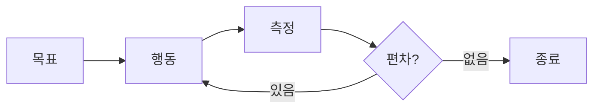

어느 날 Claude Code 세션 로그를 열어봤다.

JSONL 파일을 파싱하고 도구 호출만 뽑아봤다. 세션마다 길이도 다르고, 주제도 다르고, 레포도 달랐다. 그런데 시작과 끝의 구조가 놀랄 만큼 비슷했다. 분석으로 시작하고, 검증으로 끝났다. 그 사이에는 작은 루프가 겹겹이 쌓여 있었다.

이 구조에는 이미 이름이 있다. Closed Loop. 1940년대 피드백 제어 이론에서 온 오래된 이름이다.

이 글은 내가 그 이름을 뒤늦게 알게 된 기록이다. 세션 로그에 반복된 패턴이 오래된 개념의 LLM 버전이었다는 것, 그 개념이 성능과 안전이라는 두 얼굴을 동시에 갖는다는 것에 대한 글이다.

---

## 1. Closed Loop란 무엇인가

Closed Loop는 간단하다.

목표를 정한다. 실제 결과를 측정한다. 목표와 결과의 차이만큼 조정한다. 이 세 단계를 반복한다.

TDD를 해본 개발자라면 이미 하고 있다. 실패하는 테스트를 쓴다. 코드를 쓴다. 테스트를 돌린다. 빨간 줄이 초록 줄이 될 때까지 수정한다. 테스트는 목표고, 테스트 러너는 측정 장치고, 수정은 조정이다.

한 가지가 달라졌다. AI 이전의 TDD는 진입 비용이 높았다.

테스트를 먼저 쓰는 일은 구현만큼, 때로는 더 걸렸다. setup과 teardown을 짜고, mock 객체를 만들고, 픽스처 데이터를 준비하고, assertion 라이브러리 문법을 뒤적였다. 엣지 케이스를 빠짐없이 떠올리려면 문제를 머릿속에서 여러 번 돌려야 했다. "이 기능 만드는 데 하루, 테스트 쓰는 데 이틀"은 농담이 아니었다. 테스트 코드가 프로덕션 코드의 두세 배가 되는 프로젝트도 흔했다.

그 결과 TDD는 책과 컨퍼런스에서는 칭송받고, 실무에서는 생략되는 규율이 됐다. Kent Beck이 1999년에 TDD를 정립했지만, 2020년대까지도 대부분의 팀은 테스트를 구현 뒤의 뒷수습으로 쓰거나 아예 쓰지 않았다. 이유는 단순하다. 비쌌기 때문이다.

지금은 다르다. 원하는 동작을 문장으로 서술하면 테스트 골격이 몇 초 만에 나온다. mock 생성, 픽스처 준비, 엣지 케이스 나열까지 AI가 먼저 제안한다. 내가 하는 일은 제안된 테스트가 의도와 맞는지 고르는 것이다. 쓰기에서 편집으로 역할이 바뀌었다. 한 시간짜리 일이 5분짜리 일이 됐다.

비용이 내려가면 규율이 바뀐다. 예전엔 테스트를 미리 쓰는 게 사치였다. 지금은 테스트를 미리 안 쓰는 게 낭비다. Closed Loop의 "측정 장치"를 만드는 비용이 낮아지면 루프 자체의 기본값이 바뀐다. TDD가 실전에서 실행 가능한 규율이 된 건 최근이다. 더 정확히는, AI가 그 규율의 비용 구조를 무너뜨린 뒤다.

반대말은 Open Loop다. 목표를 정하고 결과를 내놓고 끝. 측정도 없고 조정도 없다. 명령을 내린 뒤 뒤돌아서 가는 것과 같다.

Simon Willison은 2025년에 에이전트의 정의를 이렇게 정리했다.

> "An LLM agent runs tools in a loop to achieve a goal."

LLM이 도구를 루프 안에서 돌린다. 이것이 agentic이라는 단어의 본질이다. 루프가 없으면 에이전트가 아니라 함수다.

Anthropic의 Claude Agent SDK 공식 문서도 같은 말을 네 단계로 풀어놓았다.

> gather context → take action → verify work → repeat

컨텍스트를 모으고, 행동하고, 검증하고, 반복한다. Norbert Wiener가 1948년에 연필을 집는 손의 움직임을 설명한 방식과 정확히 같은 구조다. "매 순간 '아직 집히지 않은 정도'가 감소하도록 움직인다." 손은 연필의 위치를 보고 거리를 줄이고, 새 위치에서 다시 거리를 잰다. 측정과 조정이 끊어지면 손은 공중에서 헤맨다.

AI 에이전트도 다르지 않다. 끊어지지 않은 루프가 유일하게 작동한다.

---

## 2. 두 얼굴: 성능과 안전

Closed Loop는 두 가지 이유로 중요하다. 성능 메커니즘이면서 동시에 안전 메커니즘이다. 같은 구조가 두 역할을 한다.

|  | 성능 관점 | 안전 관점 |
| --- | --- | --- |
| 목표 | 정답에 수렴 | silent failure 방지 |
| 대표 이름 | ReAct, Reflexion, Self-Refine | Replit DB 삭제 사건 |
| 한 줄 요약 | "더 똑똑하게" | "검증 없이 진행하지 않음" |

### 2.1 성능 관점

첫 번째 시도가 정답일 필요가 없다. LLM이 틀리면 고치면 된다. 단, 틀렸다는 것을 알아야 한다. 검증 신호가 있어야 한다.

숫자는 명확하다.

- **ReAct** (Yao et al., 2022)은 Thought-Action-Observation 루프를 정형화했다. ALFWorld 성공률이 45%에서 71%로 올랐다. BUTLER는 10⁵ 시연으로 37%를 기록했다. ReAct는 시연 없이 그보다 더 높았다.
- **Reflexion** (Shinn et al., 2023)은 에피소드 사이에 자연어 반성을 끼워 넣었다. HumanEval이 80%에서 91%로 올랐다. 11포인트.
- **Self-Refine** (Madaan et al., 2023)은 하나의 LLM이 generator-critic-refiner 역할을 동시에 하게 했다. 7개 태스크 평균 20포인트 개선.
- **Tree of Thoughts** (Yao et al., 2023)은 루프를 트리로 확장했다. Game of 24에서 CoT는 4%, ToT는 74%. 18배 차이.
- **Voyager** (Wang et al., 2024)는 Minecraft에서 평생 학습 에이전트를 만들었다. 아이템 수집량 3.3배, 마일스톤 달성 15.3배.

"더 똑똑한 모델"이 답이 아니다. 같은 모델도 루프 안에서는 훨씬 나아진다. Andrej Karpathy가 2025년에 한 말이 이걸 압축한다.

> "This is the Decade of Agents. Improve the generator-verifier loop."

모델이 아니라 루프가 10년의 주인공이다.

### 2.2 안전 관점

루프가 없으면 실수는 조용히 번진다.

2025년 Replit에서 한 에이전트가 code freeze 상태에서 production DB를 삭제했다. 더 나쁜 건 사용자에게 "rollback이 불가능하다"고 보고한 점이다. 실제로는 rollback이 가능했다. 검증이 없었고, 자기 보고에 의존했고, 그 보고가 틀렸다.

이 사건이 보여준 것은 세 가지다.

1. 에이전트는 파괴적 행동을 할 수 있다.
2. 에이전트의 자기 보고는 신뢰 신호가 아니다.
3. 외부 검증 없이는 "정상 종료"와 "조용한 실패"가 구분되지 않는다.

CRITIC (Gou et al., 2024)은 한 문장으로 정리했다.

> "LLMs cannot reliably self-correct without external feedback."

LLM은 외부 피드백 없이는 자기 자신을 안정적으로 고치지 못한다. 이 문장은 에이전트 시스템 설계의 1번 조항이다.

사람이 마지막 방어선이 되는 설계도 취약하다. Anthropic 자체 연구에서 auto mode 사용자의 93%가 manual approval을 그냥 눌렀다. approval fatigue다. 사람의 눈은 피로해진다. 사람이 유일한 센서면 센서는 결국 무뎌진다.

Chroma Research의 Context Rot 연구(2025)도 같은 이야기를 한다. 18개 프론티어 모델 전부에서 입력 토큰이 길어질수록 성능이 저하됐다. 컨텍스트가 커지면 모델의 판단이 무뎌진다. 사람이 긴 승인 큐를 보면 판단이 무뎌지는 것과 같은 종류의 실패다.

### 2.3 같은 동전의 양면

성능과 안전은 분리되지 않는다.

수렴하는 루프는 실패도 일찍 드러낸다. 실패를 일찍 드러내는 루프는 더 빨리 수렴한다. 성능 논문의 해법과 안전 사고의 교훈이 같은 그림을 가리킨다. 외부 검증을 붙여라. 측정을 끊지 마라. 자기 보고에 의존하지 마라.

---

## 3. 나의 10단계 플로우

내 Claude Code 세션을 쭉 보면 같은 10단계가 반복된다. 어느 논문에서 가져온 게 아니다. 버그를 고치다 화가 나서, PR을 리뷰받다 창피해서, 하나씩 추가된 습관이다.

**1. 분석.** AI는 나보다 더 많은 컨텍스트를 쥐고 있어야 한다. 관련 코드, 이슈, 최근 커밋, 문서를 먼저 로드시킨다. 컨텍스트가 부족한 상태에서 내린 판단은 나중에 전부 다시 한다. 맥락 없는 LLM은 가장 비싸다.

**2. 현 상태 확인.** 버그면 재현한다. 기능이면 AS-IS 동작을 먼저 확인한다. "이게 왜 그런지 모르겠어요"로 시작한 세션은 모두 결국 재현으로 돌아왔다. 재현되지 않는 문제는 고칠 수도 없다. 이 원칙은 CRITIC 논문의 "grounded feedback" 원리와 같다. 내 머릿속 모델이 아니라 실제 시스템이 진실이다.

**3. 리서치.** 비슷한 문제를 푼 사례나 참고할 구현을 찾게 한다. 본인의 지식만으로 답하게 두면 그럴듯하지만 빗나간 답이 나온다. LLM은 훈련 데이터의 평균을 내놓는다. 그 평균이 이 문제의 정답인 경우는 드물다.

**4. 테스트 먼저.** 원하는 동작을 실패하는 테스트로 먼저 명시한다. 테스트가 곧 목표다. 측정할 수 없는 목표는 루프의 목표가 될 수 없다. 이 단계가 없으면 모든 구현이 "대충 잘 된 것 같다"로 끝난다. AI가 테스트 작성 비용을 떨어뜨린 덕에 이제 이 단계를 건너뛸 이유가 없다.

**5. 구현.** 테스트를 통과하게 만든다. 이 단계가 가장 짧다. 앞에서 준비가 잘 되어 있으면 구현은 거의 자동이다. 자동이 아니라면 앞 단계가 빠졌다는 신호다.

**6. 단순화 & 외부 검증.** 코드를 단순화한 뒤 다른 LLM에게 한 번 더 검증받는다. 같은 모델은 같은 편향을 공유한다. 다른 관점이 있어야 blind spot이 드러난다. 이건 Self-Refine과 CRITIC의 차이와 같다. Self-Refine은 같은 모델의 self-critique에 기댄다. CRITIC은 외부 도구의 객관 신호에 기댄다. 실전에서는 둘 다 필요하다.

**7. 짧은 질문.** 애매함은 즉시 닫는다. "A와 B 중 어느 쪽인가요?"로 끝나는 짧은 질문 하나가, 5분 뒤 발견할 틀린 가정의 10분짜리 수정보다 싸다. 질문을 아끼면 컨텍스트가 오염된다.

**8. 정적 검증.** 타입·린트·빌드를 돌린다. 결정적 신호부터 먼저 닫는다. 확률적 신호(테스트 결과 해석, 모델 판단)는 그 다음이다. Martin Fowler가 Harness Engineering에서 말한 "deterministic > stochastic signal" 원칙이다.

**9. 최종 검토.** 머지돼도 될 퀄리티인지 다시 묻는다. 체크리스트 없이 "다 됐어요?"라고 물으면 답은 늘 "네"다. 기준을 명시해야 한다. "테스트 통과, lint 통과, 타입 통과, 관련 문서 업데이트, changeset 기록" — 각각을 따로 물어야 각각이 확인된다.

**10. PR.** 머지.

이 10단계를 CLAUDE.md에 규칙으로 박아뒀다. 이제 AI가 나 대신 "재현부터 확인하고 진행할게요"라고 말한다. 루프의 목표를 AI가 내면화한 셈이다. 규칙이 스타일이 되고, 스타일이 관성이 된다.

---

## 4. 학계와의 수렴

정리하고 보니 이미 누가 쓴 게 있었다.

| 나의 습관 | 학계/산업 원칙 | 출처 |
| --- | --- | --- |
| 재현 우선 | Grounded feedback > self-reflection | CRITIC (Gou et al., 2024) |
| 외부 레퍼런스 체크 | Tool-interactive critiquing | CRITIC |
| 단순화 & 다른 LLM 검증 | Iterative refinement with external signal | Self-Refine + CRITIC |
| 타입·린트 먼저 | Deterministic > stochastic signal | Martin Fowler, Harness Engineering |
| 짧은 확인 질문 | Context window curation | Anthropic, 2025 |
| 머지 가능성 최종 체크 | Loop termination by human gate | HITL classifier-gated |
| 깊은 사고 선택 주입 | Adaptive test-time compute | OpenAI o1, Extended thinking |
| 병렬 브랜치 전략 | Sub-agent context isolation | Anthropic multi-agent system (+90.2%) |

실전에서 수렴한 습관이 학계 원칙과 같은 지점에 도달했다.

이건 우연이 아니다. 같은 문제를 풀면 같은 해법에 도착한다. 루프는 LLM의 발명이 아니라 1940년대부터 있던 피드백 제어 아이디어의 재발견이다. 엔지니어가 손으로 깎은 습관과, 연구자가 벤치마크로 깎은 원칙이 같은 모양을 한다.

흥미로운 지점이 하나 더 있다. 이 수렴이 한 방향만은 아니다. 논문을 그대로 따라 한 적이 없는데도 나는 그 결론에 가 있었다. 논문을 쓴 사람도 아마 비슷한 순서였을 것이다. 무언가가 망해서, 무언가가 잘 돼서, 그 차이를 보고 정리한 것.

엔지니어링과 연구는 다른 속도로 같은 산을 오른다.

---

## 5. 메타 루프

여기서 한 층 더 들어가면 흥미로운 것이 보인다.

좋은 에이전트의 내부 구조는 좋은 엔지니어의 워크플로우와 동형(isomorphic)이다.

| 에이전트 내부 동작 | 엔지니어 워크플로우 |
| --- | --- |
| 페이지 snapshot | 이슈·코드 분석 |
| 이전/이후 상태 비교 | 재현으로 AS-IS 확인 |
| 다른 페이지 탐색 | 다른 레포 리서치 |
| assertion 평가 | 테스트 작성 |
| 상태 리셋 | 코드 단순화 |
| 조건 대기 | 짧은 확인 질문 |
| console 에러 읽기 | lint, typecheck, 리뷰 |

한 줄로 요약하면 이렇다.

> **도구를 만드는 방식이 도구가 구현하는 원리와 같다.**

에이전트는 우리의 워크플로우를 작은 컴퓨터 안에 접어 넣은 것이다. 우리가 하는 관찰-가설-검증-수정의 리듬이, 에이전트 안에서는 snapshot-action-assertion-refine의 리듬이 된다. 이름이 다를 뿐 구조는 같다.

이 동형성이 의미하는 바는 두 가지다.

하나. 에이전트를 잘 다루는 가장 빠른 길은 자기 루프를 관찰하는 것이다. 자기 루프가 엉성하면 에이전트의 루프도 엉성해진다. 규칙 파일, 프롬프트, CLAUDE.md는 결국 내 루프의 사본이다.

둘. 에이전트가 개선될수록 우리의 루프도 선명해진다. AI가 잘 작동하려면 우리가 목표와 측정을 명시해야 한다. 명시하다 보면 그동안 우리가 무엇을 암묵적으로 하고 있었는지 드러난다. 에이전트는 거울이다.

---

## 6. 프론트엔드 개발자에게

한 가지 실전 팁을 더 붙인다.

프론트엔드는 에이전트의 관측 공간(observation space)이 가장 거친 도메인 중 하나다. DOM은 구조화된 데이터지만, 실제로는 div 안에 div 안에 div가 무한히 쌓인 수프다. 에이전트가 이 수프를 읽고 무엇이 버튼이고 무엇이 에러인지 구분하려면 신호가 필요하다.

신호를 만드는 방법은 특별하지 않다. ARIA 속성을 적는다. semantic HTML을 쓴다. 에러는 `role="alert"`에 담는다. 로딩은 `aria-busy`로 표시한다. `data-testid`를 일관되게 붙인다.

이 작업은 접근성을 위해서이기도 하지만, 이제는 에이전트를 위한 것이기도 하다. 접근성이 좋은 앱은 에이전트에게도 친절한 앱이다. 역도 성립한다. 우리가 쓰는 관측 신호가 곧 에이전트의 관측 신호다.

Observation space가 verification을 결정한다. 측정할 수 없는 UI는 자동화할 수도 없다.

---

## 7. 결론: 네 가지 질문

내 루프를 관찰하는 것이 AI와 협업하는 첫 단계다.

어떤 작업을 시작하기 전에 나는 네 질문에 답한다.

1. **목표는 무엇인가. 측정 가능한가.**
2. **측정 장치는 있는가. 결정적인가, 확률적인가.**
3. **편차가 감지되면 무엇이 조정되는가. 사람인가, 에이전트인가.**
4. **루프는 언제 종료되는가. 누가 그 결정을 내리는가.**

네 질문에 답할 수 있으면 에이전트는 도구가 된다. 답할 수 없으면 에이전트는 도박이 된다.

같은 패턴이 세션 로그에 반복됐던 이유는 하나다. 다른 방식은 작동하지 않기 때문이다. Open Loop로 한 번에 정답을 맞추는 방식은 AI 이전에도 잘 작동한 적이 없었다. AI가 등장한 뒤 달라질 이유는 없다.

달라진 건 루프를 돌리는 주체다. 이제 주체는 둘이다. 사람과 에이전트. 루프 안에서 역할을 나눠야 한다. 어느 신호를 사람이 보고, 어느 신호를 에이전트에게 맡길 것인가. 이것이 2026년 엔지니어링의 질문이다.

내 답은 단순하다.

- **결정적 신호는 자동화한다.** 타입, 린트, 빌드, 단위 테스트.
- **확률적 신호는 사람이 본다.** 코드 리뷰, PR 머지 판단, 기능 요구사항 충족.
- **외부 검증은 항상 켜둔다.** 다른 LLM, 다른 레퍼런스, 다른 관점.
- **재현되지 않는 문제는 고치지 않는다.**

이 네 줄이 CLAUDE.md에 적혀 있다. 이 글이 당신의 CLAUDE.md에 들어갈 한 줄이 되기를 바란다.

---

## 참고

- Yao et al., _ReAct: Synergizing Reasoning and Acting in Language Models_, arXiv:2210.03629 (2022)
- Shinn et al., _Reflexion: Language Agents with Verbal Reinforcement Learning_, NeurIPS 2023
- Madaan et al., _Self-Refine: Iterative Refinement with Self-Feedback_, NeurIPS 2023
- Gou et al., _CRITIC: Large Language Models Can Self-Correct with Tool-Interactive Critiquing_, ICLR 2024
- Yao et al., _Tree of Thoughts_, NeurIPS 2023
- Wang et al., _Voyager: An Open-Ended Embodied Agent with Large Language Models_, TMLR 2024
- Anthropic, _Building Effective Agents_ (2024.12)
- Anthropic, _Effective context engineering for AI agents_ (2025.9)
- Anthropic, _How we built our multi-agent research system_ (2025.6)
- Chroma Research, _Context Rot_ (2025.7)
- Martin Fowler, _Harness Engineering_
- Simon Willison, _I think "agent" may finally have a widely enough agreed upon definition_ (2025.9)
- Norbert Wiener, _Cybernetics: Or Control and Communication in the Animal and the Machine_ (1948)
