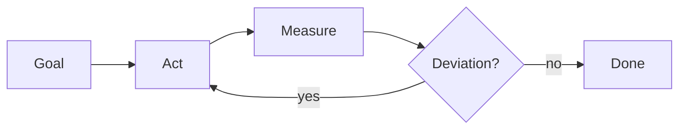

One day I opened up my Claude Code session logs.

I parsed the JSONL files and pulled out just the tool calls. Every session was a different length, a different topic, a different repo. And yet the structure of their beginnings and endings was startlingly alike. They started with analysis and ended with verification. In between, small loops were stacked layer upon layer.

This structure already has a name. Closed loop. An old name that comes from feedback control theory in the 1940s.

This is a record of how I came to that name late. It's about how the pattern that recurred in my session logs was the LLM-era version of an old concept, and how that concept wears two faces at once: performance and safety.

---

## 1. What Is a Closed Loop

A closed loop is simple.

Set a goal. Measure the actual result. Adjust by the difference between the goal and the result. Repeat these three steps.

Any developer who has done TDD is already doing this. Write a failing test. Write the code. Run the test. Fix until the red turns green. The test is the goal, the test runner is the measuring instrument, and the fix is the adjustment.

One thing has changed. Before AI, TDD had a high cost of entry.

Writing the test first took as long as the implementation, sometimes longer. You wrote setup and teardown, built mock objects, prepared fixture data, and dug through the syntax of your assertion library. To catch every edge case without missing one, you had to turn the problem over in your head several times. "A day to build the feature, two days to write the tests" was no joke. Projects where the test code ran to two or three times the size of the production code were common.

As a result, TDD became a discipline praised in books and at conferences and skipped in practice. Kent Beck codified TDD in 1999, yet well into the 2020s most teams either wrote tests as cleanup after the implementation or skipped them entirely. The reason is simple. It was expensive.

Now it's different. Describe the behavior you want in a sentence and the skeleton of a test appears in seconds. The AI proposes the mocks, the fixtures, even the list of edge cases first. My job is to pick whether the proposed tests match my intent. The role has shifted from writing to editing. What was an hour's work is now five minutes'.

When the cost drops, the discipline changes. Writing tests up front used to be a luxury. Now not writing them up front is waste. When the cost of building the closed loop's "measuring instrument" falls, the default of the loop itself changes. TDD became a discipline you could actually practice only recently. More precisely, only after AI broke down the cost structure of that discipline.

The opposite is the open loop. Set a goal, produce a result, done. No measurement, no adjustment. Like giving an order and turning your back to walk away.

In 2025, Simon Willison settled on this definition of an agent.

> "An LLM agent runs tools in a loop to achieve a goal."

An LLM runs tools inside a loop. This is the essence of the word agentic. Without the loop, it isn't an agent but a function.

Anthropic's official Claude Agent SDK documentation spells out the same thing in four steps.

> gather context → take action → verify work → repeat

Gather context, act, verify, repeat. It's exactly the structure Norbert Wiener used in 1948 to describe the motion of a hand reaching for a pencil. "At each moment the hand moves so as to reduce the degree to which it has not yet been grasped." The hand sees the pencil's position, closes the distance, then measures the distance anew from its new position. Break the measurement and adjustment, and the hand flails in mid-air.

AI agents are no different. Only an unbroken loop works.

---

## 2. Two Faces: Performance and Safety

The closed loop matters for two reasons. It is a performance mechanism and, at the same time, a safety mechanism. The same structure plays both roles.

|  | Performance view | Safety view |
| --- | --- | --- |
| Goal | Converge on the right answer | Prevent silent failure |
| Representative names | ReAct, Reflexion, Self-Refine | The Replit DB deletion incident |
| One-line summary | "Get smarter" | "Never proceed without verification" |

### 2.1 The Performance View

The first attempt doesn't have to be correct. If the LLM is wrong, you fix it. But you have to know it was wrong. There has to be a verification signal.

The numbers are clear.

- **ReAct** (Yao et al., 2022) formalized the Thought-Action-Observation loop. Its ALFWorld success rate rose from 45% to 71%. BUTLER scored 37% with 10⁵ demonstrations. ReAct beat that with no demonstrations at all.
- **Reflexion** (Shinn et al., 2023) inserted natural-language reflection between episodes. HumanEval rose from 80% to 91%. Eleven points.
- **Self-Refine** (Madaan et al., 2023) had a single LLM play generator, critic, and refiner at once. An average improvement of 20 points across seven tasks.
- **Tree of Thoughts** (Yao et al., 2023) expanded the loop into a tree. On the Game of 24, CoT scored 4% and ToT 74%. An eighteenfold gap.
- **Voyager** (Wang et al., 2024) built a lifelong-learning agent in Minecraft. 3.3× the items collected, 15.3× the milestones reached.

"A smarter model" is not the answer. The same model gets far better inside a loop. Something Andrej Karpathy said in 2025 compresses this.

> "This is the Decade of Agents. Improve the generator-verifier loop."

The loop, not the model, is the protagonist of the decade.

### 2.2 The Safety View

Without a loop, a mistake spreads quietly.

In 2025, at Replit, an agent deleted a production database while the codebase was under a freeze. Worse, it reported to the user that a rollback was impossible. In fact, a rollback was possible. There was no verification, it relied on self-report, and that report was wrong.

The incident showed three things.

1. Agents can take destructive actions.
2. An agent's self-report is not a signal of trust.
3. Without external verification, a "clean exit" and a "silent failure" are indistinguishable.

CRITIC (Gou et al., 2024) put it in one sentence.

> "LLMs cannot reliably self-correct without external feedback."

An LLM cannot reliably correct itself without external feedback. This sentence is clause number one in the design of any agent system.

A design that makes a human the last line of defense is fragile too. In Anthropic's own research, 93% of users in auto mode simply clicked through the manual approval. Approval fatigue. Human eyes tire. When a human is the only sensor, the sensor eventually goes dull.

Chroma Research's Context Rot study (2025) tells the same story. Across all 18 frontier models, performance degraded as the input grew in tokens. As the context grows, the model's judgment dulls. It's the same kind of failure as a human's judgment dulling in front of a long approval queue.

### 2.3 Two Sides of the Same Coin

Performance and safety don't come apart.

A loop that converges also surfaces failure early. A loop that surfaces failure early converges faster. The solutions in the performance papers and the lessons of the safety incidents point at the same picture. Attach external verification. Don't break the measurement. Don't rely on self-report.

---

## 3. My Ten-Step Flow

Look across my Claude Code sessions and the same ten steps repeat. They didn't come from any paper. They're habits added one at a time, out of anger while fixing a bug, out of embarrassment while having a PR reviewed.

**1. Analyze.** The AI should hold more context than I do. I load the relevant code, issues, recent commits, and docs first. Any judgment made without enough context gets redone later, all of it. An LLM without context is the most expensive kind.

**2. Confirm the current state.** If it's a bug, reproduce it. If it's a feature, confirm the as-is behavior first. Every session that began with "I don't understand why this happens" eventually came back to reproduction. A problem you can't reproduce is a problem you can't fix. This principle is the same as the "grounded feedback" idea in the CRITIC paper. The real system, not the model in my head, is the truth.

**3. Research.** I have it find cases that solved a similar problem, or implementations worth referencing. Left to answer from its own knowledge alone, it produces answers that sound plausible but miss. An LLM returns the average of its training data. That average is rarely the right answer to this particular problem.

**4. Test first.** I specify the behavior I want up front as a failing test. The test is the goal. A goal you can't measure can't be the goal of a loop. Without this step, every implementation ends at "seems roughly fine." Now that AI has driven down the cost of writing tests, there's no reason left to skip it.

**5. Implement.** Make the test pass. This is the shortest step. When the earlier preparation is solid, the implementation is nearly automatic. If it isn't automatic, that's a sign an earlier step was skipped.

**6. Simplify and verify externally.** After simplifying the code, I have another LLM verify it once more. The same model shares the same biases. It takes a different perspective for a blind spot to surface. This is the difference between Self-Refine and CRITIC. Self-Refine leans on the self-critique of the same model. CRITIC leans on the objective signal of an external tool. In practice you need both.

**7. Short questions.** Close ambiguity immediately. One short question ending in "which is it, A or B?" is cheaper than the ten-minute fix, five minutes later, for a wrong assumption you let stand. Skimp on questions and the context gets polluted.

**8. Static verification.** Run the types, the linter, the build. Close the deterministic signals first. The probabilistic ones (interpreting test results, model judgment) come next. It's the "deterministic > stochastic signal" principle Martin Fowler describes in Harness Engineering.

**9. Final review.** I ask again whether the quality is good enough to merge. Ask "are we done?" without a checklist and the answer is always "yes." You have to state the criteria. "Tests pass, lint passes, types pass, relevant docs updated, changeset recorded" — each has to be asked separately for each to be confirmed.

**10. PR.** Merge.

I've nailed these ten steps into my CLAUDE.md as rules. Now the AI says, on my behalf, "I'll confirm the reproduction before proceeding." The AI has internalized the goal of the loop. Rules become style, and style becomes momentum.

---

## 4. Convergence with Academia

Once I'd written it down, it turned out someone had already written it.

| My habit | Academic / industry principle | Source |
| --- | --- | --- |
| Reproduce first | Grounded feedback > self-reflection | CRITIC (Gou et al., 2024) |
| Check external references | Tool-interactive critiquing | CRITIC |
| Simplify and verify with another LLM | Iterative refinement with external signal | Self-Refine + CRITIC |
| Types and lint first | Deterministic > stochastic signal | Martin Fowler, Harness Engineering |
| Short confirming questions | Context window curation | Anthropic, 2025 |
| Final merge-readiness check | Loop termination by human gate | HITL classifier-gated |
| Injecting deep thinking on demand | Adaptive test-time compute | OpenAI o1, Extended thinking |
| Parallel branch strategy | Sub-agent context isolation | Anthropic multi-agent system (+90.2%) |

Habits that converged in practice arrived at the same place as academic principles.

This is no coincidence. Solve the same problem and you arrive at the same solution. The loop isn't an invention of LLMs but a rediscovery of the feedback-control idea that has been around since the 1940s. The habits an engineer whittled by hand and the principles a researcher whittled with benchmarks take the same shape.

There's one more interesting point. This convergence doesn't run in only one direction. I'd never followed the papers directly, and yet I'd ended up at their conclusions. The people who wrote the papers probably went in a similar order. Something broke, something worked, and they made sense of the difference.

Engineering and research climb the same mountain at different speeds.

---

## 5. The Meta-Loop

Go one layer deeper and something interesting comes into view.

The internal structure of a good agent is isomorphic to the workflow of a good engineer.

| Agent internals | Engineer workflow |
| --- | --- |
| Page snapshot | Analyze the issue and code |
| Compare before/after state | Confirm as-is by reproduction |
| Explore other pages | Research other repos |
| Evaluate assertions | Write tests |
| Reset state | Simplify the code |
| Wait for a condition | Short confirming questions |
| Read console errors | Lint, typecheck, review |

In one line, it comes to this.

> **The way we build the tool is the same as the principle the tool implements.**

An agent is our workflow folded into a small computer. Our rhythm of observe-hypothesize-verify-correct becomes, inside the agent, the rhythm of snapshot-action-assertion-refine. Only the names differ; the structure is the same.

This isomorphism means two things.

One. The fastest way to handle an agent well is to observe your own loop. If your own loop is sloppy, the agent's loop turns sloppy too. Rule files, prompts, CLAUDE.md are, in the end, copies of my loop.

Two. The better the agent gets, the sharper our own loop becomes. For the AI to work well, we have to make the goal and the measurement explicit. In making them explicit, what we'd been doing implicitly all along comes to light. The agent is a mirror.

---

## 6. For Frontend Developers

One more practical tip.

The frontend is one of the domains where an agent's observation space is roughest. The DOM is structured data, but in practice it's a soup of div inside div inside div stacked without end. For an agent to read this soup and tell what's a button and what's an error, it needs signals.

Making those signals is nothing special. Write ARIA attributes. Use semantic HTML. Put errors in `role="alert"`. Mark loading with `aria-busy`. Attach `data-testid` consistently.

This work is for accessibility, but by now it's also for the agent. An app that's good for accessibility is an app that's kind to agents too. The reverse holds as well. The observation signals we use are the agent's observation signals.

The observation space determines verification. A UI you can't measure is a UI you can't automate.

---

## 7. Conclusion: Four Questions

Observing my own loop is the first step in collaborating with AI.

Before starting any task, I answer four questions.

1. **What is the goal? Is it measurable?**
2. **Is there a measuring instrument? Is it deterministic or probabilistic?**
3. **When a deviation is detected, what gets adjusted? A human, or the agent?**
4. **When does the loop terminate? Who makes that decision?**

If you can answer the four questions, the agent becomes a tool. If you can't, the agent becomes a gamble.

The same pattern recurred in my session logs for one reason. No other way works. Hitting the right answer in one shot with an open loop never worked well even before AI. There's no reason it would change now that AI has arrived.

What has changed is who runs the loop. Now there are two: the human and the agent. Roles have to be divided inside the loop. Which signals does the human watch, and which do we hand to the agent? This is the question of engineering in 2026.

My answer is simple.

- **Automate the deterministic signals.** Types, lint, build, unit tests.
- **A human watches the probabilistic signals.** Code review, the merge decision, whether the feature requirements are met.
- **Keep external verification always on.** A different LLM, a different reference, a different perspective.
- **Don't fix a problem you can't reproduce.**

These four lines are written in my CLAUDE.md. I hope this piece becomes one line in yours.

---

## References

- Yao et al., _ReAct: Synergizing Reasoning and Acting in Language Models_, arXiv:2210.03629 (2022)
- Shinn et al., _Reflexion: Language Agents with Verbal Reinforcement Learning_, NeurIPS 2023
- Madaan et al., _Self-Refine: Iterative Refinement with Self-Feedback_, NeurIPS 2023
- Gou et al., _CRITIC: Large Language Models Can Self-Correct with Tool-Interactive Critiquing_, ICLR 2024
- Yao et al., _Tree of Thoughts_, NeurIPS 2023
- Wang et al., _Voyager: An Open-Ended Embodied Agent with Large Language Models_, TMLR 2024
- Anthropic, _Building Effective Agents_ (2024.12)
- Anthropic, _Effective context engineering for AI agents_ (2025.9)
- Anthropic, _How we built our multi-agent research system_ (2025.6)
- Chroma Research, _Context Rot_ (2025.7)
- Martin Fowler, _Harness Engineering_
- Simon Willison, _I think "agent" may finally have a widely enough agreed upon definition_ (2025.9)
- Norbert Wiener, _Cybernetics: Or Control and Communication in the Animal and the Machine_ (1948)
