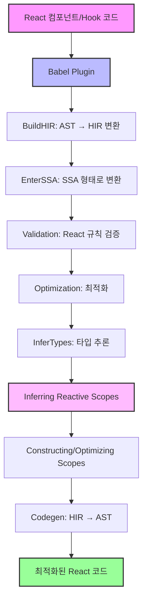
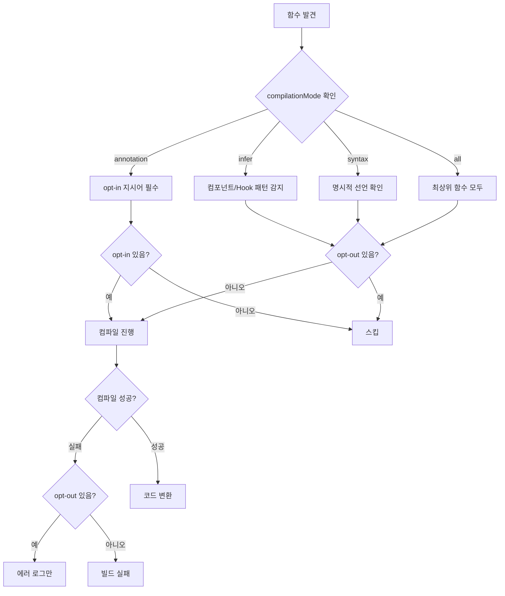
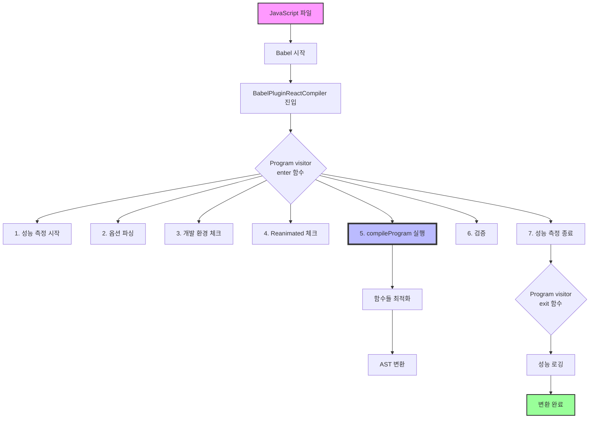

# TODO

지금 나는 react-compiler 패키지를 분석하고 있는데, 일단 최소한 미니멈하게 코드를 작성해서 배포해서 돌리고 싶어 어떤 코드들을 기본적으로 추가하면되는거야?

- [ ] HIR 이해하기
- [ ] 바벨 플러그인 예제 만들고, 플러그인 타입들 이해

## 📋 학습 로드맵

#### 1.1 React Compiler란 무엇인가?

- [ ] `compiler/README.md` 읽고 정리하기
- [ ] React Compiler의 목적과 필요성 이해
  - [ ] 자동 메모이제이션의 개념
  - [ ] React.memo(), useMemo(), useCallback()의 문제점
  - [ ] 성능 최적화의 자동화 필요성
- [ ] 기존 React 최적화 방식과의 차이점 정리

#### 1.2 설계 목표와 원칙 심화 학습

- [ ] `compiler/docs/DESIGN_GOALS.md` 상세 분석
- [ ] 각 목표별 심화 이해:
  - [ ] "Bound the amount of re-rendering" - 리렌더링 제한의 의미
  - [ ] "Keep startup time neutral" - 시작 시간 중립성의 중요성
  - [ ] "Just work on idiomatic React code" - 관용적 React 코드란?
- [ ] Non-Goals 분석:
  - [ ] 왜 완벽한 최적화를 추구하지 않는가?
  - [ ] React 규칙 위반 코드를 지원하지 않는 이유
  - [ ] 클래스 컴포넌트를 지원하지 않는 이유
- [ ] 디자인 원칙의 실제 적용 사례 찾아보기

#### 2.1 컴파일러 파이프라인 상세 분석

- [ ] 각 단계별 역할과 책임 이해:
  - [ ] **Babel Plugin 단계**
    - [ ] 컴파일 대상 함수 결정 메커니즘
    - [ ] opt-in/opt-out 지시어 동작 원리
    - [ ] `compiler/packages/babel-plugin-react-compiler/src/Babel/BabelPlugin.ts` - Babel 플러그인 진입점
    - [ ] `compiler/packages/babel-plugin-react-compiler/src/Entrypoint/Program.ts` - compileProgram 핵심 로직
    - [ ] `compiler/packages/babel-plugin-react-compiler/src/Entrypoint/Pipeline.ts` - 컴파일 파이프라인 구현
    - [ ] `compiler/packages/babel-plugin-react-compiler/src/Entrypoint/Options.ts` - 플러그인 옵션 파싱
  - [ ] **Lowering (BuildHIR) 단계**
    - [ ] Babel AST → HIR 변환 과정
    - [ ] JavaScript 평가 순서 의미론 보존 방법
    - [ ] Control Flow Graph 구성 원리
    - [ ] `compiler/packages/babel-plugin-react-compiler/src/HIR/BuildHIR.ts` - 핵심 변환 로직 (4315줄!)
    - [ ] `compiler/packages/babel-plugin-react-compiler/src/HIR/HIR.ts` - HIR 자료구조 정의
    - [ ] `compiler/packages/babel-plugin-react-compiler/src/HIR/HIRBuilder.ts` - HIR 빌더 유틸리티
    - [ ] `compiler/packages/babel-plugin-react-compiler/src/HIR/Environment.ts` - 환경 설정과 타입 정보
  - [ ] **SSA Conversion 단계**
    - [ ] SSA(Static Single Assignment)란?
    - [ ] SSA 형태의 장점과 필요성
    - [ ] `compiler/packages/babel-plugin-react-compiler/src/SSA/EnterSSA.ts` - SSA 변환 구현
    - [ ] `compiler/packages/babel-plugin-react-compiler/src/SSA/EliminateRedundantPhi.ts` - Phi 노드 최적화
  - [ ] **Validation 단계**
    - [ ] React 규칙 검증 메커니즘
    - [ ] 조건부 Hook 호출 감지 방법
    - [ ] `compiler/packages/babel-plugin-react-compiler/src/Validation/ValidateHooksUsage.ts` - Hook 사용 규칙 검증
    - [ ] `compiler/packages/babel-plugin-react-compiler/src/Validation/ValidateNoRefAccessInRender.ts` - ref 접근 검증
    - [ ] `compiler/packages/babel-plugin-react-compiler/src/Validation/ValidateNoSetStateInRender.ts` - 렌더링 중 setState 방지
    - [ ] `compiler/packages/babel-plugin-react-compiler/src/Validation/ValidatePreservedManualMemoization.ts` - 수동 메모이제이션 보존
  - [ ] **Optimization 단계**
    - [ ] Dead Code Elimination 구현
    - [ ] Constant Propagation 구현
    - [ ] `compiler/packages/babel-plugin-react-compiler/src/Optimization/` 분석
  - [ ] **Type Inference 단계**
    - [ ] 보수적 타입 추론의 의미
    - [ ] Hook 타입 식별 방법
    - [ ] `compiler/packages/babel-plugin-react-compiler/src/TypeInference/` 탐색
  - [ ] **Reactive Scopes 추론**
    - [ ] Reactive Scope의 정의와 개념
    - [ ] Scope 그룹화 알고리즘
    - [ ] `compiler/packages/babel-plugin-react-compiler/src/ReactiveScopes/BuildReactiveFunction.ts` - ReactiveFunction 구성 (1494줄)
    - [ ] `compiler/packages/babel-plugin-react-compiler/src/ReactiveScopes/InferReactiveScopeVariables.ts` - Scope 변수 추론
    - [ ] `compiler/packages/babel-plugin-react-compiler/src/ReactiveScopes/CodegenReactiveFunction.ts` - 코드 생성 (2694줄!)
    - [ ] `compiler/packages/babel-plugin-react-compiler/src/ReactiveScopes/MergeReactiveScopesThatInvalidateTogether.ts` - Scope 병합 최적화
    - [ ] `compiler/packages/babel-plugin-react-compiler/src/ReactiveScopes/PruneNonEscapingScopes.ts` - 불필요한 Scope 제거
  - [ ] **Codegen 단계**
    - [ ] ReactiveFunction → Babel AST 변환
    - [ ] 생성된 코드의 최적화 보장

#### 2.2 핵심 자료구조 이해

- [ ] HIR (High-level Intermediate Representation)
  - [ ] Basic Block 구조
  - [ ] Instruction 타입들
  - [ ] Terminal 타입들
  - [ ] Control Flow Graph 표현
- [ ] ReactiveFunction 구조
  - [ ] HIR과 AST의 하이브리드 특성
  - [ ] Scope 표현 방식
- [ ] SSA Identifier 시스템

### 3단계: 실습 환경 구축 (1주)

#### 3.1 개발 환경 설정

- [ ] React Compiler 저장소 클론 및 빌드
  ```bash
  cd compiler
  pnpm install
  pnpm snap:build
  ```
- [ ] 테스트 러너 이해
  - [ ] `snap` 커스텀 테스트 러너 동작 원리
  - [ ] Golden test 파일 구조
  - [ ] Watch 모드 활용법

#### 3.2 디버깅 환경 구축

- [ ] VSCode 디버깅 설정
- [ ] 브레이크포인트 설정 전략
- [ ] 컴파일러 파이프라인 단계별 디버깅

### 4단계: 코드 패턴 분석 (2-3주)

#### 4.1 Fixtures 분석

- [ ] `compiler/fixtures/` 디렉토리 구조 파악
- [ ] 각 카테고리별 테스트 케이스 분석:
  - [ ] 기본 컴포넌트 최적화 패턴
  - [ ] Hook 사용 패턴
  - [ ] 조건부 렌더링 패턴
  - [ ] 반복문 처리 패턴
  - [ ] 이벤트 핸들러 최적화
  - [ ] Props 전달 최적화

#### 4.2 최적화 전후 비교

- [ ] 각 fixture의 입력과 출력 비교
- [ ] 생성된 메모이제이션 코드 분석
- [ ] 성능 개선 효과 측정

### 5단계: 컴파일러 패스 상세 분석 (3-4주)

#### 5.1 각 패스별 깊이 있는 학습

- [ ] **BuildHIR 패스**

  - [ ] AST 노드별 변환 규칙
  - [ ] 표현식 평가 순서 처리
  - [ ] 제어 흐름 구조 변환
  - [ ] 예외 처리 메커니즘

- [ ] **EnterSSA 패스**

  - [ ] Phi 노드 삽입 알고리즘
  - [ ] 변수 재명명 전략
  - [ ] 지배자 트리 구성

- [ ] **InferTypes 패스**

  - [ ] 타입 격자(Type Lattice) 이해
  - [ ] 타입 전파 알고리즘
  - [ ] Hook 타입 추론 규칙

- [ ] **InferReactiveScopes 패스**

  - [ ] 의존성 분석 알고리즘
  - [ ] Scope 경계 결정 로직
  - [ ] Invalidation 추적

- [ ] **PruneReactiveScopes 패스**
  - [ ] Scope 병합 조건
  - [ ] Hook 포함 Scope 처리
  - [ ] 최적화 트레이드오프

### 6단계: 실제 프로젝트 적용 (2주)

#### 6.1 샘플 프로젝트 최적화

- [ ] 간단한 Todo 앱 만들기
- [ ] React Compiler 적용 전후 비교
- [ ] 번들 크기 측정
- [ ] 성능 프로파일링

#### 6.2 복잡한 시나리오 테스트

- [ ] 중첩된 컴포넌트 구조
- [ ] 복잡한 상태 관리
- [ ] 대량 데이터 렌더링
- [ ] 실시간 업데이트 처리

### 7단계: 컴파일러 확장 및 기여 (3-4주)

#### 7.1 새로운 최적화 패스 구현

- [ ] 간단한 최적화 아이디어 구상
- [ ] 패스 구현 및 테스트
- [ ] 성능 영향 측정

#### 7.2 버그 수정 및 개선

- [ ] 이슈 트래커에서 버그 찾기
- [ ] 재현 테스트 케이스 작성
- [ ] 수정 사항 구현
- [ ] PR 제출 프로세스

### 8단계: 고급 주제 (2-3주)

#### 8.1 ESLint 플러그인 통합

- [ ] `compiler/packages/eslint-plugin-react-compiler/` 분석
- [ ] 규칙 검증 메커니즘
- [ ] 커스텀 규칙 작성

#### 8.2 런타임 지원

- [ ] `compiler/packages/react-compiler-runtime/` 이해
- [ ] 런타임 헬퍼 함수들
- [ ] 메모이제이션 캐시 관리

#### 8.3 성능 분석 도구

- [ ] `compiler/packages/react-compiler-healthcheck/` 활용
- [ ] 컴파일 가능성 검사
- [ ] 최적화 효과 예측

#### 9.1 점진적 도입 계획

- [ ] 파일별 opt-in 전략
- [ ] 컴포넌트별 적용 우선순위
- [ ] 팀 교육 계획

#### 9.2 모니터링 및 디버깅

- [ ] 프로덕션 성능 모니터링
- [ ] 컴파일러 관련 이슈 디버깅
- [ ] 롤백 전략 수립

### 10단계: 지속적 학습 (ongoing)

#### 10.1 최신 업데이트 팔로우

- [ ] GitHub 릴리즈 노트 구독
- [ ] RFC 문서 읽기
- [ ] 컨퍼런스 발표 시청

#### 10.2 커뮤니티 참여

- [ ] Discord/Slack 채널 참여
- [ ] 블로그 포스트 작성
- [ ] 오픈소스 기여

## 📚 추가 학습 자료

### 필수 읽기 자료

- [ ] React 공식 문서의 React Compiler 섹션
- [ ] React Conf 2024 React Compiler 발표
- [ ] React 팀의 기술 블로그 포스트

### 참고 자료

- [ ] Babel 플러그인 작성 가이드
- [ ] SSA Form 이론 논문
- [ ] 컴파일러 최적화 기법 교재

### 실습 프로젝트

- [ ] Mini React Compiler 구현
- [ ] 커스텀 최적화 패스 작성
- [ ] 성능 벤치마크 스위트 구축

## 🎯 마일스톤 체크포인트

### 1개월 차

- [ ] React Compiler 기본 개념 완벽 이해
- [ ] 개발 환경 구축 완료
- [ ] 첫 번째 fixture 분석 완료

### 2개월 차

- [ ] 컴파일러 파이프라인 전체 이해
- [ ] 간단한 최적화 패턴 식별 가능
- [ ] 디버깅 능력 확보

### 3개월 차

- [ ] 실제 프로젝트에 적용 경험
- [ ] 컴파일러 코드 수정 경험
- [ ] 성능 분석 능력 확보

### 6개월 차

- [ ] React Compiler 전문가 수준
- [ ] 오픈소스 기여 경험
- [ ] 팀 내 전파 교육 가능

## 💡 학습 팁

1. **작은 것부터 시작하기**: 복잡한 최적화보다 간단한 패턴부터 이해하기
2. **질문하고 토론하기**: 커뮤니티에 적극적으로 참여하여 의문점 해결하기
3. **문서화하기**: 학습한 내용을 자신만의 언어로 정리하여 문서화하기
4. **실패를 두려워하지 않기**: 컴파일러 수정 시 에러는 당연한 것, 에러에서 배우기

---

_이 가이드는 React Compiler v0.0.0 기준으로 작성되었습니다. 버전 업데이트에 따라 내용이 변경될 수 있습니다._



# optin optout




